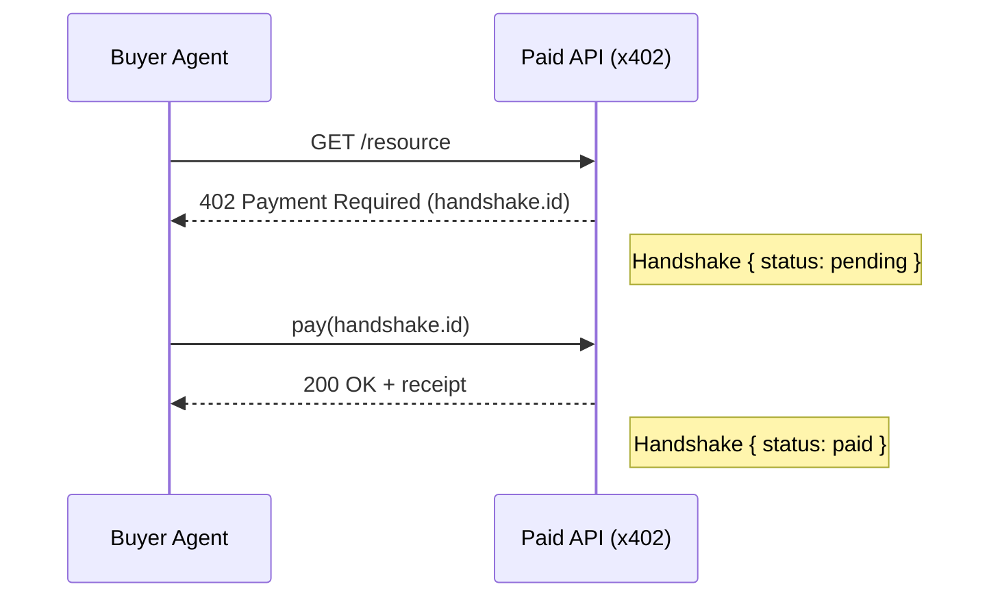

# Economic Observability

Aether's economic observability layer adds agentic transaction awareness to the
existing graph contracts **without introducing a new graph layer or breaking
any existing schema**. Every primitive is additive and optional; existing data
remains valid and no migration is required.

The contracts live in `packages/shared/economic.ts` and are re-exported from
`@aether/shared`. They mirror the structure backend services and downstream
graph mutators already use, so the SDK and backend speak the same language
about money flowing through agentic flows.

## What the layer adds

| Primitive                | Kind          | Purpose                                                                  |
| ------------------------ | ------------- | ------------------------------------------------------------------------ |
| `EconomicPayload`        | extension     | Embeddable economic block on any Action. `rail` accepts both the agentic-commerce vocabulary (`stripe \| bank \| crypto \| internal`) and the canonical Aether rails declared in `provenance.ts` (`fiat \| invoice \| onchain \| x402 \| internal_credit`). |
| `Handshake`              | new node      | x402-style payment request / resolve handshake.                          |
| `ResourceNode`           | new node      | Unified generic resource (campaign, ad_account, bank_account, api, model). |
| `RelationshipExtensions` | extension     | `flow_ref`, `interaction_mode`, `economic_involved`, `outcome`.          |
| `EconomicState`          | derived state | Aggregates over Actions — never persisted.                               |
| `Authorization`          | embedded      | Auth source/scope/limit on Actions or Agents.                            |

The only new node types are `Handshake` and `ResourceNode`. The rest are
optional fields on the existing Action / Relationship / State models.

## Quick examples

### 1. Action with an economic block

```ts
import type { EconomicPayload } from '@aether/shared';

const economic: EconomicPayload = {
  amount: 0.05,
  currency: 'USD',
  direction: 'pay',
  counterparty_type: 'service',
  counterparty_id: 'svc_x402_demo',
  rail: 'internal',
};

aether.track('agent_task', {
  taskId: 't1',
  agent: { kind: 'agent', id: 'agent_buyer' },
  status: 'completed',
  economic, // backend reads this and links spend → outcome
});
```

### 2. Handshake lifecycle



```ts
import { createHandshake, transitionHandshake } from '@aether/shared';

let hs = createHandshake({
  id: 'hs_x402_1',
  request_id: 'req_x402_1',
  required_amount: 0.05,
  timestamp: Date.now(),
});

// pending → paid (or pending → failed). All other transitions throw
// HandshakeStateError.
hs = transitionHandshake(hs, 'paid');
```

### 3. A2A payment with a resource node

```ts
import type {
  EconomicPayload,
  RelationshipExtensions,
  ResourceNode,
} from '@aether/shared';

const apiResource: ResourceNode = {
  id: 'res_api_summarizer',
  type: 'api',
  platform: 'openai',
  metadata: { model: 'gpt-x', priceCentsPerCall: 5 },
};

const payment: EconomicPayload = {
  amount: 0.05,
  currency: 'USD',
  direction: 'pay',
  counterparty_type: 'service',
  counterparty_id: apiResource.id,
  rail: 'internal',
};

const edge: RelationshipExtensions = {
  flow_ref: { flow_id: 'flow_summarize_42', sequence: 0 },
  interaction_mode: 'A2A',
  economic_involved: true,
};
```

### 4. Spend → revenue outcome linkage

```ts
import {
  aggregateEconomicState,
  validateRelationshipExtensions,
} from '@aether/shared';

const adSpend = {
  id: 'act_spend_1',
  economic: {
    amount: 100,
    currency: 'USD',
    direction: 'pay',
    counterparty_type: 'platform',
    counterparty_id: 'meta_ads',
    rail: 'stripe',
  },
};
const revenue = {
  id: 'act_rev_1',
  economic: {
    amount: 350,
    currency: 'USD',
    direction: 'receive',
    counterparty_type: 'platform',
    counterparty_id: 'shopify',
    rail: 'stripe',
  },
};

const causal = validateRelationshipExtensions({
  flow_ref: { flow_id: 'campaign_acme_2026Q1', sequence: 1 },
  interaction_mode: 'A2A',
  outcome: { metric: 'revenue', value: 350 },
});

const state = aggregateEconomicState([adSpend, revenue], { units: 7 });
// → { total_spend: 100, total_revenue: 350, unit_cost: 14.285714... }
```

### 5. H2A authorized spend → A2A execution

```ts
import { validateAuthorization, validateEconomicPayload } from '@aether/shared';

const auth = validateAuthorization({
  source: 'human',
  scope: 'spend:campaign=acme',
  limit: 200,
});

const a2a = {
  id: 'act_a2a_1',
  authorization: auth,
  economic: validateEconomicPayload({
    amount: 50,
    currency: 'USD',
    direction: 'pay',
    counterparty_type: 'agent',
    counterparty_id: 'agent_buyer',
    rail: 'internal',
  }),
};
```

## Validation

Every public type has a paired `validate*` function that throws a structured
error on bad input:

| Function                          | Throws                          |
| --------------------------------- | ------------------------------- |
| `validateEconomicPayload`         | `EconomicValidationError`       |
| `validateHandshake`               | `EconomicValidationError`       |
| `validateResourceNode`            | `EconomicValidationError`       |
| `validateRelationshipExtensions`  | `EconomicValidationError`       |
| `validateAuthorization`           | `EconomicValidationError`       |
| `assertHandshakeTransition`       | `HandshakeStateError`           |
| `transitionHandshake`             | `HandshakeStateError`           |
| `assertHandshakeReference`        | `RelationshipIntegrityError`    |
| `assertActionReference`           | `RelationshipIntegrityError`    |

Errors expose:

- `name` — the class name
- `code` — a stable machine-readable code (`ECONOMIC_VALIDATION`, `HANDSHAKE_STATE`, `RELATIONSHIP_INTEGRITY`)
- `details` — a structured bag suitable for log enrichment

## Aggregation rules

`aggregateEconomicState(actions, options)` computes a derived `EconomicState`
in **O(n)** with no joins or graph traversal. Rules:

- Actions without an `economic` block are ignored.
- Amounts are summed **per currency** in `byCurrency` to prevent financially
  incorrect cross-currency totals.
- `direction === 'pay'` accumulates into `total_spend`.
- `direction === 'receive'` accumulates into `total_revenue`.
- `spend_rate = total_spend / (windowMs / 1000)` when `windowMs > 0`.
- `unit_cost  = total_spend / units` when `units > 0`.
- Flat scalar fields (`total_spend`, `total_revenue`, `spend_rate`,
  `unit_cost`, `currency`) are populated **only when every contributing
  Action shares a single currency**. Mixed-currency inputs only populate
  `byCurrency`, so callers cannot accidentally read summed-across-currencies
  numbers.

The state is **never persisted directly** — always recompute from Actions.

## Handshake state machine

```
pending ─┬─→ paid    (terminal)
         └─→ failed  (terminal)
```

Same-state transitions are rejected. `paid` and `failed` are terminal.

## Schema reference

### `Action` (extension)

```ts
interface Action {
  // ...existing fields...
  economic?: EconomicPayload;
  authorization?: Authorization;
}
```

### `Handshake` (new node)

```ts
interface Handshake {
  id: string;
  request_id: string;          // indexed
  required_amount: number;
  status: 'pending' | 'paid' | 'failed';
  timestamp: number;
}
```

Edges:
- `Action ─initiates──→ Handshake`
- `Handshake ─resolves_to──→ Action`

### `ResourceNode` (new node)

```ts
interface ResourceNode {
  id: string;
  type: 'campaign' | 'ad_account' | 'bank_account' | 'api' | 'model';
  platform?: string;
  metadata?: Record<string, unknown>;
}
```

### `Relationship` (extension)

```ts
interface Relationship {
  // ...existing fields...
  flow_ref?: { flow_id: string; sequence: number };
  interaction_mode?: 'H2H' | 'H2A' | 'A2A' | 'A2H';
  economic_involved?: boolean;
  outcome?: { metric: 'revenue' | 'conversion' | 'latency'; value: number };
}
```

### `State` (extension, derived)

```ts
interface State {
  // ...existing fields...
  economic?: {
    spend_rate?: number;
    total_spend?: number;
    total_revenue?: number;
    unit_cost?: number;
    /** Always populated when any Action carried an economic block. */
    byCurrency?: Record<string, {
      total_spend: number;
      total_revenue: number;
      spend_rate?: number;
      unit_cost?: number;
    }>;
    /** Single shared currency; absent on mixed-currency input. */
    currency?: string;
  };
}
```

## Performance contract

- Aggregation is **O(n)** over actions.
- No new graph traversal, no joins, no extra indexes are required.
- `EconomicState` is computed lazily from Actions when read; it is never
  persisted, so write-path cost is unchanged.
- Memory overhead per Action with an economic block is bounded (~6 fixed-size
  fields).

## Backwards compatibility

Every field added by this module is optional. Existing events, edges, and
states without economic data continue to validate. No migration is required.
