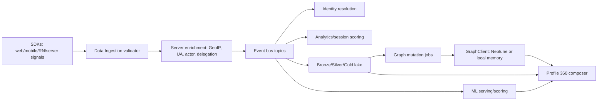
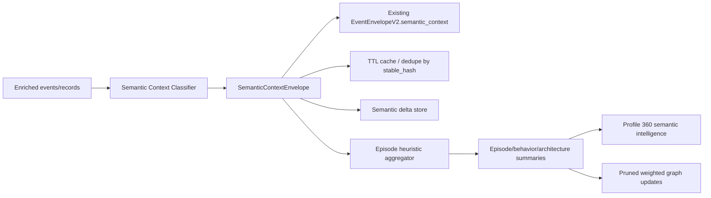
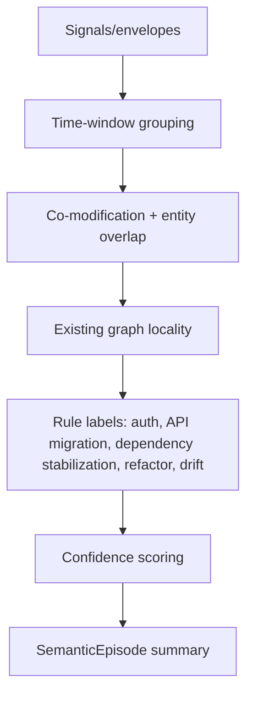
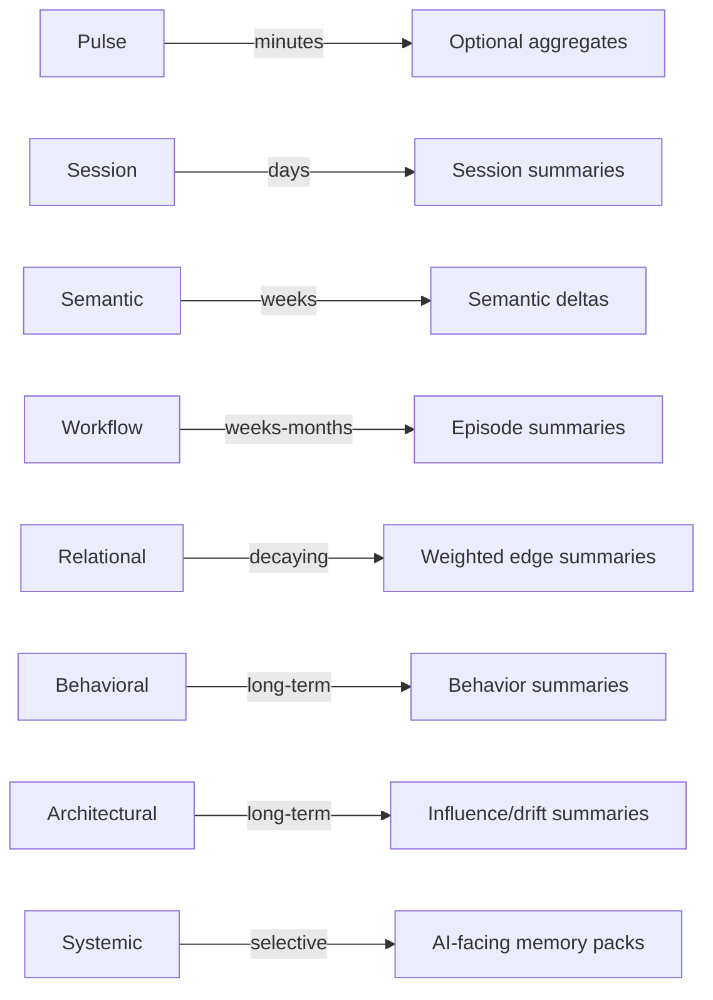
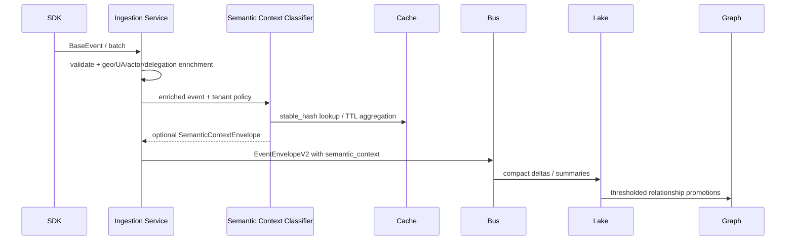
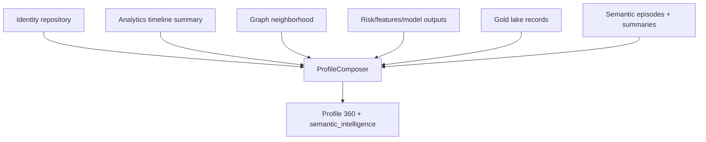

# Semantic Context Intelligence Layer

## 1. Architectural analysis of current AETHER systems

AETHER already has the primitives needed for semantic intelligence; the right strategy is to add a compact context layer rather than redesign the platform.

### Current system map

| Subsystem | Existing role | Semantic extension posture |
| --- | --- | --- |
| SDKs and Data Ingestion | SDKs emit lightweight analytics, identity, wallet, transaction, consent, page/screen, heartbeat, and operational events. The ingestion service validates, enriches with GeoIP/user-agent/actor/delegation metadata, assigns project IDs, and publishes to downstream sinks. | Keep SDK payloads structurally unchanged. Add optional backend-owned semantic envelopes only after validation/enrichment. |
| Event bus | `shared.events.events.Event` carries topic, tenant, source, correlation, payload, retry, and an optional v2 envelope. Topics already cover ingestion, identity, analytics, ML, agent, commerce, resolution, and Profile 360 behaviors. | Attach `semantic_context` as another optional v2 envelope block. Unknown consumers ignore it. |
| Graph layer | `GraphClient` abstracts Neptune in staging/production and in-memory graph storage locally. `VertexType` and `EdgeType` already include identity, Profile 360, agent, commerce, web3, and cross-domain graph concepts. | Use relationship references and existing graph edges first; create new semantic edges only after thresholds and pruning. |
| Profile 360 | `ProfileComposer` composes identity, identifiers, consent, analytics timeline, graph neighborhood, risk/features, and lake Gold records without duplicating upstream logic. | Add semantic summaries as another composed intelligence section, sourced from envelopes/episodes/relationship summaries. |
| Data Lake | Silver/Gold repositories and lake graph mutation jobs already materialize wallet/protocol/social/governance edges and model features. Drift monitoring compares reference/current feature and prediction distributions. | Persist only summarized semantic deltas, episodes, and decaying relationship aggregates; do not store raw telemetry timelines. |
| ML serving and scoring | Existing model/scoring services provide predictions, risk, trust, anomaly, extraction-defense, and drift reports. | Use deterministic heuristics plus confidence scoring first. Only call expensive ML/vector work after enrichment thresholds. |
| Privacy/compliance | Consent, DSR, retention, field masking, and vectorized/de-identified processing already exist. | Treat semantic intelligence as derived, summarized data with TTL/decay and provenance. Never expose raw pulse/session streams. |

## 2. Existing semantic pipeline mapping



The additive semantic path inserts after server enrichment and before/alongside existing bus, lake, graph, and Profile 360 composition:



## 3. Existing schema analysis

AETHER already uses additive schema patterns:

- Events keep `payload` stable and add optional `EventEnvelopeV2` blocks.
- Graph vertices/edges carry open-ended `properties` dictionaries.
- Profile 360 composes from repositories rather than normalizing everything into one database.
- Lake repositories store domain records and metrics without requiring SDK changes.

The semantic layer follows that pattern with an optional `semantic_context` block, plus compact Python/TypeScript interfaces. It avoids table proliferation by using one envelope shape for events, lake records, graph vertices, and Profile 360 summaries.

## 4. Existing graph/index architecture analysis

Current graph architecture is suitable for semantic augmentation because it already provides:

- A single `GraphClient` abstraction with fail-closed Neptune behavior outside local development.
- Open edge properties for confidence, validity windows, tenant IDs, and scope hashes.
- Relationship layer classification for H2H, H2A, A2H, and A2A edges.
- Existing profile graph queries through `get_neighbors`.
- Lake-driven graph rebuilds/incremental mutations.

The new layer must therefore **reference graph edges before creating graph edges**. `RelationshipRef.graph_edge_ref` allows envelopes to point at existing edges. New semantic edges should be emitted only when aggregate confidence and support exceed policy thresholds.

## 5. Existing enrichment system analysis

The ingestion service already demonstrates the desired control plane:

1. SDK emits minimal context.
2. Backend enriches based on configuration.
3. Backend stamps processing metadata.
4. Backend can resolve actor/delegation without SDK schema changes.

Semantic enrichment should use the same model. The SDK may continue emitting lightweight operational metadata; the backend chooses layer classification, persistence, vectorization, graph density, and summarization.

## 6. Exact extension points

| Extension point | Additive change | Why it is safe |
| --- | --- | --- |
| `EventEnvelopeV2` | Optional `semantic_context` dictionary. | Existing v1 and v2 consumers ignore unknown/absent fields. |
| Data ingestion `EnrichedEvent` | Optional `semanticContext?: SemanticContextEnvelope`. | Backend-owned optional field; SDK `BaseEvent` remains unchanged. |
| Shared graph | Semantic relationship refs first; only thresholded graph mutations later. | Avoids graph explosion and schema migration. |
| Lake repositories | Store compact deltas/episodes/summaries as derived records. | No replacement of Bronze/Silver/Gold data contracts. |
| Profile 360 composer | Add a semantic section from summarized intelligence. | Composer already aggregates optional subsystems. |
| Drift monitor | Add semantic drift reports as low-frequency derived checks. | Reuses existing drift-report pattern. |
| Cache | Dedupe envelopes by `stable_hash`. | Cheap vector reuse and storage suppression. |

## 7. Semantic layer integration strategy

The implemented model uses purpose-oriented layers instead of payload-depth tiers:

| Layer | Purpose | Default persistence | Default vector behavior | Graph behavior |
| --- | --- | --- | --- | --- |
| Pulse | Ultra-light transient signal detection. | `transient` | Never by default. | No graph writes; aggregate only. |
| Session | Temporal continuity windows. | `short_ttl` | Off by default. | Sparse temporal refs. |
| Semantic | Entity/intent understanding. | `medium_ttl` | Selective when confidence is high and no vector exists. | Relationship refs; thresholded edges. |
| Workflow | Multi-step workflow inference. | `medium_ttl` | Usually summarized, not vectorized unless promoted. | Episode-local weighted refs. |
| Relational | Graph-aware relationship modeling. | `long_decaying` | Reuse vectors only. | Decayed/pruned weighted edges. |
| Behavioral | Pattern/specialization modeling. | `summarized` | Off by default. | Aggregate summaries. |
| Architectural | System-wide influence and drift propagation. | `summarized` | Selective/low frequency. | Centrality and influence summaries. |
| Systemic | Cross-system AI-facing synthesis. | `summarized` | Highly selective reuse. | Sparse cross-repo refs. |

## 8. `SemanticContextEnvelope` schema design

The implemented envelope contains:

- `primary_layer` and `layers` for classification.
- `confidence`, `temporal_weight`, and `recency_score` for weighted intelligence.
- `relationship_refs` for graph-aware references without duplicate edges.
- `semantic_deltas` for compact change persistence.
- `compressed_payload` for bounded, cache-friendly context.
- `workflow_refs` and `episode_refs` for continuity.
- `enrichment` for server-owned controls such as `vectorize`.
- `persistence` for TTL, decay, summarization, and pruning caps.
- `vector_ref` for vector reuse without duplicate embeddings.
- `stable_hash` for dedupe, cache keys, and vector reuse decisions.

Example envelope:

```json
{
  "schema_version": "1.0",
  "primary_layer": "workflow",
  "layers": ["workflow", "semantic"],
  "confidence": 0.82,
  "temporal_weight": 0.91,
  "recency_score": 0.77,
  "stable_hash": "...",
  "workflow_refs": ["wf:auth-hardening"],
  "semantic_deltas": [
    {"field": "intent", "operation": "inferred", "summary": "authentication hardening", "confidence": 0.84}
  ],
  "relationship_refs": [
    {"kind": "WORKFLOW_PARTNER", "target_ref": "gateway.rs", "strength": 0.74, "confidence": 0.81}
  ],
  "persistence": {"class": "medium_ttl", "ttl_seconds": 5184000, "decay_rate": 0, "max_relationship_refs": 16, "max_payload_keys": 32}
}
```

## 9. Relationship generation strategy

1. Generate relationship **candidates** from temporal proximity, co-occurrence, entity references, existing graph locality, repeated workflow membership, and semantic similarity.
2. Score candidates with `confidence * strength * recency * support_count`.
3. Attach candidates as `relationship_refs` first.
4. Promote only top candidates to graph mutations after:
   - minimum support count,
   - confidence threshold,
   - tenant-level density budget,
   - per-entity max edge cap,
   - edge-type allowlist,
   - TTL/decay policy selection.
5. Decay or summarize weak edges instead of deleting high-value historical intelligence immediately.

Supported relationship types are `USES`, `MODIFIES`, `INFLUENCES`, `DERIVES_FROM`, `CO_OCCURS_WITH`, `DEPENDS_ON`, `FREQUENTLY_PRECEDES`, `CAUSED_DRIFT_IN`, `SEMANTICALLY_SIMILAR`, and `WORKFLOW_PARTNER`.

## 10. Semantic episode generation strategy

Semantic Episodes are lightweight workflow narratives. The first implementation is rule-driven and deterministic:



The implemented `SemanticEpisodeHeuristics` infers labels such as `Authentication Hardening Workflow` from signal text/path terms and calculates confidence from temporal compactness, co-modified entity count, recurrence, and rule hits.

## 11. Adaptive enrichment strategy

Backend enrichment policy should evaluate each record with the following gates:

1. **Eligibility:** consent, tenant policy, event type, and data quality.
2. **Layer classification:** pulse/session/semantic/workflow/etc.
3. **Cost budget:** tenant and subsystem budgets for vectorization, graph writes, and deep analysis.
4. **Persistence policy:** TTL/summarized/ephemeral/deep.
5. **Vector decision:** reuse existing vector by `stable_hash` or `vector_ref`; generate only for high-confidence semantic/workflow/architectural/systemic records.
6. **Graph decision:** relationship refs by default; promote only after pruning.
7. **Summarization:** persist deltas and episodes, not raw telemetry.

## 12. Persistence lifecycle architecture



Persistent intelligence is summarized, compressed, relationship-aware, and low frequency. Ephemeral analysis is on-demand, discardable, and used only when a profile, recommendation, risk investigation, or AI-context request justifies deeper compute.

## 13. Graph density control strategy

- Store relationship references in envelopes before writing graph edges.
- Enforce `max_relationship_refs` per envelope and per-layer caps.
- Use top-k pruning by confidence × strength.
- Decay edge strength on read or scheduled compaction.
- Collapse repeated pulse/session signals into aggregate counters.
- Promote workflow episode edges rather than every constituent event edge.
- Keep architectural/systemic edges sparse and summary-oriented.
- Prefer existing graph edge refs over duplicate semantic edges.

## 14. Cost-control strategy

- Server-controlled enrichment intensity.
- No embeddings for pulse/session by default.
- Stable-hash dedupe before persistence/vectorization.
- Delta persistence instead of payload snapshots.
- Cache high-repeat classifications.
- Low-frequency architectural/systemic indexing.
- Ephemeral deep analysis with discardable outputs unless promoted.
- Tenant budgets for vectors, graph writes, and relationship candidates.

## 15. Vector minimization strategy

Vectors are expensive and should be treated as promoted derived artifacts:

1. Check `vector_ref` and stable-hash cache first.
2. Do not vectorize pulse/session/relational/behavioral by default.
3. Vectorize semantic/workflow only when confidence exceeds threshold and the compressed payload has durable value.
4. Reuse entity, workflow, or episode vectors when semantic deltas are small.
5. Persist semantic deltas and summary text separately from embeddings so vectors can be regenerated selectively.

## 16. Storage optimization strategy

- Store one envelope field instead of multiple schema columns.
- Use bounded `compressed_payload` keys per persistence policy.
- Persist semantic deltas instead of full duplicate semantic payloads.
- Store episodes as summaries with entity refs and confidence.
- Store long-term behavior/architecture intelligence as aggregates.
- Use TTL classes for transient and session layers.
- Use stable hashes to dedupe repeated envelopes.

## 17. Query optimization strategy

- Query Profile 360 from summaries, not raw events.
- Resolve graph neighborhoods with edge caps and depth defaults.
- Use `stable_hash`, `workflow_refs`, `episode_refs`, and tenant IDs as primary lookup keys.
- Cache per-profile semantic packs for AI context.
- Keep relationship refs denormalized in summaries for fast reads; promote only high-value edges to graph.
- Use lake Gold/Summary records for analytics rather than scanning Bronze/Silver event streams.

## 18. Profile 360 synthesis architecture

Profile 360 should add a `semantic_intelligence` section composed from summaries:

```json
{
  "semantic_identity": {"summary": "...", "confidence": 0.84},
  "behavioral_specialization": [{"label": "auth workflows", "score": 0.78}],
  "workflow_continuity": [{"episode_id": "se_...", "label": "Authentication Hardening Workflow"}],
  "architectural_influence": {"centrality": 0.63, "top_refs": ["gateway.rs"]},
  "semantic_drift_history": [{"field": "auth_contract", "direction": "stabilized"}],
  "relationship_centrality": {"weighted_degree": 12.4},
  "inferred_goals": [{"goal": "reduce auth risk", "confidence": 0.81}],
  "adaptive_ai_context": {"memory_pack_ref": "ctx:...", "ttl_seconds": 86400}
}
```

Human-facing views should show concise summaries, confidence, recency, and influence—not raw telemetry or giant timelines. AI-facing memory should be compact, purpose-scoped, and cached.

## 19. Incremental rollout strategy

1. **Code-only primitives:** ship envelope dataclasses and TypeScript interfaces; no producers enabled.
2. **Shadow classification:** classify enriched records in memory/log-sampled mode; no persistence.
3. **Pulse/session TTL cache:** enable cheap continuity aggregation.
4. **Semantic deltas:** persist high-confidence semantic deltas for selected tenants.
5. **Episode summaries:** enable rule-driven episode generation from cached session/semantic signals.
6. **Profile 360 read integration:** expose summarized semantic intelligence behind a flag.
7. **Graph promotion:** allow thresholded relationship promotion with strict caps.
8. **Architectural/systemic summaries:** low-frequency batch jobs after density/cost metrics are stable.

## 20. Backward compatibility strategy

- Existing SDK event schemas remain unchanged.
- `BaseEvent` remains unchanged.
- `EnrichedEvent.semanticContext` is optional and backend-owned.
- `EventEnvelopeV2.semantic_context` is optional.
- Existing graph vertices/edges remain valid.
- Existing Profile 360 endpoints can omit semantic sections unless enabled.
- Consumers that do not recognize semantic blocks continue to read `payload` normally.

## 21. Migration-free integration strategy

The first integration requires no database migration:

- Use optional event envelope fields.
- Use existing record `properties`/metadata dictionaries.
- Use cache/TTL stores for pulse/session.
- Store summaries in existing derived/lake repositories where available.
- Use graph refs before graph writes.

A later migration may add optimized indexes for `stable_hash`, `episode_id`, and `workflow_ref`, but the architecture does not require it for rollout.

## 22. Example Rust/TypeScript interfaces

### TypeScript

```ts
export type SemanticLayer =
  | 'pulse' | 'session' | 'semantic' | 'workflow'
  | 'relational' | 'behavioral' | 'architectural' | 'systemic';

export interface SemanticContextEnvelope {
  schema_version: string;
  primary_layer: SemanticLayer;
  layers: SemanticLayer[];
  confidence: number;
  temporal_weight: number;
  recency_score: number;
  stable_hash: string;
  persistence: {
    class: 'transient' | 'short_ttl' | 'medium_ttl' | 'long_decaying' | 'summarized' | 'ephemeral_deep';
    ttl_seconds: number | null;
    decay_rate: number;
    max_relationship_refs: number;
    max_payload_keys: number;
  };
  relationship_refs?: Array<{
    kind: 'USES' | 'MODIFIES' | 'INFLUENCES' | 'DERIVES_FROM' | 'CO_OCCURS_WITH' |
      'DEPENDS_ON' | 'FREQUENTLY_PRECEDES' | 'CAUSED_DRIFT_IN' |
      'SEMANTICALLY_SIMILAR' | 'WORKFLOW_PARTNER';
    target_ref: string;
    strength: number;
    confidence: number;
    graph_edge_ref?: string;
  }>;
  semantic_deltas?: Array<{ field: string; operation: string; summary: string; confidence: number }>;
  compressed_payload?: Record<string, unknown>;
  workflow_refs?: string[];
  episode_refs?: string[];
  enrichment?: Record<string, unknown>;
  vector_ref?: string;
}
```

### Rust

```rust
#[derive(Debug, Clone, serde::Serialize, serde::Deserialize)]
#[serde(rename_all = "snake_case")]
pub enum SemanticLayer {
    Pulse,
    Session,
    Semantic,
    Workflow,
    Relational,
    Behavioral,
    Architectural,
    Systemic,
}

#[derive(Debug, Clone, serde::Serialize, serde::Deserialize)]
pub struct SemanticContextEnvelope {
    pub schema_version: String,
    pub primary_layer: SemanticLayer,
    pub layers: Vec<SemanticLayer>,
    pub confidence: f32,
    pub temporal_weight: f32,
    pub recency_score: f32,
    pub stable_hash: String,
    pub persistence: SemanticPersistencePolicy,
    pub relationship_refs: Vec<SemanticRelationshipRef>,
    pub semantic_deltas: Vec<SemanticDelta>,
    pub compressed_payload: serde_json::Value,
    pub workflow_refs: Vec<String>,
    pub episode_refs: Vec<String>,
    pub enrichment: serde_json::Value,
    pub vector_ref: Option<String>,
}
```

## 23. Data flow diagrams

### Server-controlled enrichment



### Profile 360 synthesis



## 24. Risk analysis

| Risk | Mitigation |
| --- | --- |
| Graph explosion | Relationship refs first, top-k pruning, edge promotion thresholds, decay, per-entity caps. |
| Vector churn | Stable-hash dedupe, vector refs, high-confidence selective vectorization. |
| Storage growth | TTL classes, semantic deltas, compressed payload caps, summarized retention. |
| SDK complexity | No SDK schema change; server-owned optional enrichment. |
| Query degradation | Query summaries and graph neighborhoods, not raw streams. |
| Noisy intelligence | Confidence weighting, recurrence/support requirements, profile-facing summarization. |
| Privacy exposure | Derived summaries only, consent gates, no raw telemetry in Profile 360. |
| Operational complexity | Reuse event bus, lake, cache, graph, and Profile 360 composition patterns. |

## 25. Scalability analysis

The design scales because it separates cheap signal capture from expensive semantic promotion:

- Pulse/session layers absorb high throughput with TTL and aggregation.
- Semantic/workflow layers are selective and compressed.
- Relational/behavioral/architectural/systemic layers are summary-oriented and low frequency.
- Vectors are reused and generated only above thresholds.
- Graph writes are thresholded and decayed.
- Profile 360 reads use compact summaries instead of event scans.
- Ephemeral deep analysis can be computed on demand and discarded unless promoted.

The result is a semantic intelligence platform that can power Profile 360, adaptive AI context, workflow intelligence, drift analysis, recommendations, and organizational semantic modeling without replacing AETHER's SDKs, ML systems, graph store, storage architecture, or indexing pipeline.
