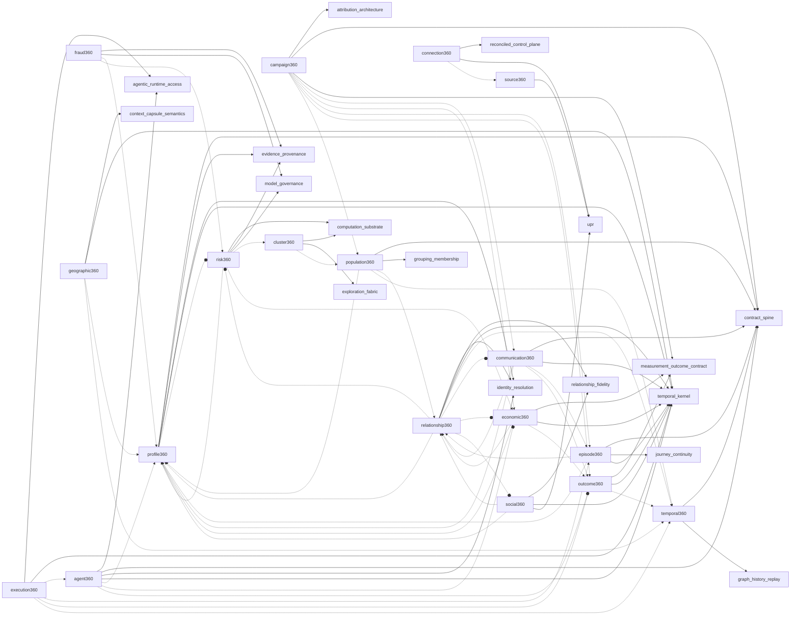

<!-- DO NOT EDIT — generated from packages/shared/contracts/intelligence-projection-registry.json -->
<!-- Run: python scripts/generate_platform_contracts.py -->

# Intelligence Projection Dependency Graph

Contract version: `1.0.0`

Hard spines (solid `-->`), required projection dependencies (dashed `-.->`) and optional projection dependencies (dotted `-.-o`). Cycles are intentional (optional unions); Mermaid renders them fine.

## Dependency graph

## Pending resolutions

| Projection | Kind | Id | Reason | Resolves in projection |
|---|---|---|---|---|
| `connection360` | authority | `reconciled_control_plane` | harness control-plane rollup (PR #529) merged; reconciled control-plane spine not yet formalized as a projection-plane authority | `connection360` |
| `economic360` | reference | `campaign_cac` | economic metric exists in packages/shared/economic-metrics.ts but is not yet absorbed into metric-registry.json | `economic360` |
| `economic360` | reference | `campaign_ltv` | economic metric exists in packages/shared/economic-metrics.ts but is not yet absorbed into metric-registry.json | `economic360` |
| `economic360` | reference | `campaign_roas` | economic metric exists in packages/shared/economic-metrics.ts but is not yet absorbed into metric-registry.json | `economic360` |
| `economic360` | reference | `campaign_spend` | economic metric exists in packages/shared/economic-metrics.ts but is not yet absorbed into metric-registry.json | `economic360` |
| `episode360` | authority | `journey_continuity` | journey continuity plane not yet formalized | `episode360` |
| `geographic360` | authority | `context_capsule_semantics` | context-capsule plane not yet formalized | `geographic360` |
| `population360` | authority | `grouping_membership` | canonical grouping/membership contract not yet formalized | `population360` |
| `temporal360` | authority | `graph_history_replay` | bitemporal ledger exists; graph-history replay API not yet built | `temporal360` |
