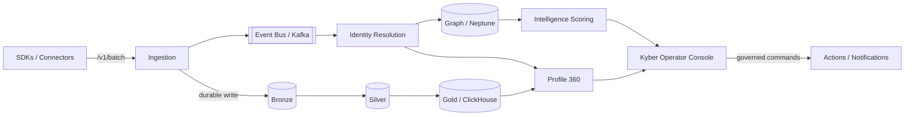

# Architecture & Operations Overview

A technical reader's map of AETHER: the shape of the system, how data moves, how
it is operated, and where the real seams and honest gaps are. This is the
architecture companion to `docs/acquisition/PRODUCTIZATION_DOSSIER.md`. For full
depth, `docs/ARCHITECTURE.md`; for the machine-checked readiness picture,
`make production-status`.

---

## 1. System shape

AETHER is a multi-tenant, event-driven platform organized as domains behind a
single FastAPI backend (65+ routers), with SDK fleets (web, React Native, native
iOS/Android cores), an operator console (Kyber), and a customer/tenant frontend.

Local development runs on in-memory fallbacks; **staging and production require
the real backends** (Postgres, Redis, Neptune, Kafka, ClickHouse, S3) and refuse
the fallbacks in hosted modes.

---

## 2. Data flow — the medallion path

- **Bronze:** raw normalized events, written **durably before the ingestion ACK**
  so nothing is acknowledged that was not persisted. `/v1/batch` enforces
  per-event consent, scrubs PII (private keys, card numbers, passwords are
  rejected), and is idempotent via a tenant-scoped Redis `set_nx`.
- **Silver:** promoted from Bronze through a **PromotionService** that gates on
  freshness, null-rate, required-field, and entity-id checks, attaching a
  per-row `quality_score` and per-check failure reasons.
- **Gold:** ClickHouse-backed analytical tier feeding Profile 360 and the CIS
  health engine. (Honest gap: economic-domain Gold DDL is unexecuted where
  ClickHouse is not provisioned.)

Provenance is per-row (e.g. the Dune feeder carries query_id / execution_id /
row_index), so lake rows are traceable end to end.

---

## 3. Identity, Profile 360, and the graph

- **Identity resolution:** four anchors in priority order (wallet > anonymous +
  fingerprint > email hash > user id), confidence-scored, with a merge endpoint
  that emits a reason + Kafka audit event and a review queue for low-confidence
  decisions.
- **Profile 360:** canonical composition across identity, analytics, consent,
  graph, and Gold; 15 intelligence sub-resources on real queries with window +
  tenant filtering; credit data behind a hard `credit` consent gate (403 on
  denial).
- **Graph:** every `EdgeType` is exhaustively mapped to H2H / H2A / A2H / A2A (or
  explicitly EXCLUDED); unknown edges **fail closed** in staging/production. A
  `GraphWriteValidator` enforces eight required properties at every write
  boundary (tenant_id, idempotency_key, actor_kind, actor_id, schema_version,
  provenance, valid_from, confidence), with consent_purpose additionally
  required on cross-layer H2A/A2H edges. Traversal has depth/result limits and
  A2A cycle detection.

---

## 4. Agent safety — mutations are governed, never direct

Agent-originated graph mutations flow **verify → stage → review batch → human
approval → commit**. `commit_approved_mutations` enforces the approval invariant
+ validator + quarantine, records partial failures **loudly per-mutation**
(never silently), preserves graph-write errors as `failed_commit`, and is
idempotent. `rollback_mutation` verifies the inverse and marks
`rollback_repair_required` (with a durable repair task) when it cannot fully
restore state — it never reports a false clean undo. Stale agent runs are swept
and replayable. **Honest gap:** hosted-mode durable storage is a P0
release-blocker — the in-memory fallback is refused in hosted modes.

---

## 5. Operations — Kyber, jobs, and governed commands

- **Jobs + scheduler (#420):** durable jobs platform; RFC 9457 problem-details;
  correlation-id propagation across the platform.
- **Kyber ops plane:** an exception queue, incidents, governed commands, and
  containment switches, all behind `require_kyber_access`. Commands authorize
  **twice** — a floor (a live, device-bound, directory-fresh workforce session)
  on the dependency, and the command's real capability / disclosure / action
  class in the handler, each writing its own decision row. Tenant scope is
  matched against what the request names and re-checked on **every** command
  transition, so a command cannot act on a tenant the operator's scope did not
  grant.
- **Kyber Missions (this branch, scaffold):** migration `20260815_kyber_missions`
  + a flag-gated monitoring-loop scaffold in `main.py`
  (`KYBER_MISSION_MONITORING_ENABLED`, default OFF). The orchestrator/aggregate
  is **not yet in the tree** — the wiring itself says the classes land with a
  future wave. Presented as scaffolding, not a feature.

---

## 6. Reliability, SLOs, and observability

- Service definitions, pipelines, runbooks, and SLOs are registered for the
  reliability surface (e.g. the semantic pipeline carries abstention-rate,
  classify-latency, and review-queue-depth SLOs keyed to real Prometheus
  series). Alert groups and Grafana dashboards are pinned to contracted metric
  names by tests, so alerts cannot drift onto series nothing emits.
- A **chaos suite** (`tests/chaos/`) runs inside `pytest tests/`: provider
  rate-limit/timeout, duplicate-webhook storm, out-of-order, worker restart,
  store interruption (mocked), graph write failure, chain reorg, cursor drift,
  reward-delivery timeout, agent stale run, partial commit, rollback failure.
  External-service legs are in-process fault models, clearly marked; the live
  legs are staging work.
- **Honest gap:** distributed tracing is a **seam, not coverage**. W3C
  traceparent helpers + correlation-id propagation exist (gated on
  `AETHER_OTEL_ENABLED`), but no OpenTelemetry SDK, spans, or exporter are
  integrated. Do not read the seam as observability.

---

## 7. Deployment profiles

Two profiles (#492): **staging** and **lean-production**. Both require real
backends and refuse in-memory fallbacks. Rollout flags (economic, agent,
activation, missions) default OFF; the operating rule is one subsystem enabled at
a time, validated end to end, rolled back (flag off) on any SLO breach.
Deployment readiness scores **3/5** and scale readiness **3/5** — the machinery
(Terraform, preflight, load harness) exists but infra is unprovisioned and no
baselines are recorded.

---

## 8. CI and gate-truth

`make ci-check` runs `repo_doctor --ci`: the registry test suite from
`config/test_suites.yaml` (seven `skip_policy: never` CI pytest suites with
`hard_fail_skip`, so a **skip is a FAIL**), `validate_test_suite_coverage.py`
asserting declared == executed, `npm run test`, and ~40 validators. Four honest
caveats bound it: the Hardhat suite runs in a separate GitHub workflow;
`npm --workspaces --if-present` can skip a workspace lacking a test script;
`/v1/ready` skips the migration check with no DB pool; and staging-preflight HTTP
SKIPs without `--base-url`. Green ci-check means "the registry suite and
validators passed", not "everything possible was tested".

---

## 9. Operational gaps summary

| Gap | Area | Class |
|-----|------|-------|
| Infra unprovisioned; secrets unloaded | deployment / cloud readiness | P0 |
| Agent hosted-mode durable storage | graph mutation safety | P0 |
| Contracts unaudited (no mainnet) | smart contracts / proofs | P0 |
| Zero live providers (all CREDENTIAL_WAITING) | provider certification | P0 |
| OTel SDK/exporter not integrated | observability / tracing | P1 |
| No recorded load baselines; Neptune unvalidated at scale | scale readiness | P2 |

See also: `docs/ARCHITECTURE.md`,
`docs/acquisition/PRODUCTIZATION_DOSSIER.md`,
`docs/acquisition/RISK_AND_READINESS_REGISTER.md`,
`docs/readiness/STAGING_READINESS_DOSSIER.md`.
