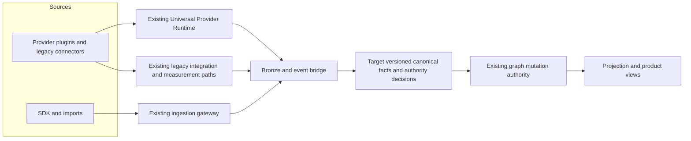

# Universal Connector Runtime implementation blueprint

**Inventory baseline:** `origin/main` at `7b1fb6f58f0281c7e0929d241b3dbf1a2ed87aed` (reviewed 2026-10-02).
**Integration baseline:** `origin/Development` at `17503aef9fa3a9515a029471796f1ee3510a5b2c` (fetched 2026-10-03); feature-branch integration and migration-head reconciliation are still pending.
**State:** implementation specification with an in-branch foundation. The rollout steps described as *target* are not claims that tenant traffic has moved or a provider is live-certified.

This blueprint turns the Shopify and commerce ingestion proposal into a buildable program for every repository connector family. It also completes the requested migration, canonical ID, and canonical event design. Shopify is the first commerce proof, while the architecture applies to other providers according to their actual capabilities and data rights.

## Read this set in order

1. [Runtime architecture](runtime-architecture.md) — current implementation inventory, authority map, extension interfaces, provider and domain boundaries, API and product surfaces.
2. [Canonical contracts](canonical-contracts.md) — source IDs and aliases, raw and canonical event semantics, provenance, revisions, authority, money, identity, graph submission, and examples.
3. [Commerce reference slice](commerce-reference-slice.md) — Shopify streams, provider versus SDK/payment authority, end-to-end customer loop, fixtures, and product evidence.
4. [Migration and delivery](migration-and-delivery.md) — ordered work packages, per-provider and per-tenant cutover, shadow comparison, certification, rollback, operations, and evidence gates.
5. [Provider outbox rollout](provider-outbox-rollout.md) — relay startup, delivery evidence, replay limits, and promotion blockers for the implemented bridge.

Existing authorities remain in force: [Universal Provider Runtime](../../UNIVERSAL-PROVIDER-RUNTIME.md), [provider migration](../../../operations/PROVIDER-MIGRATION.md), [provider certification](../../../reference/PROVIDER-CERTIFICATION.md), [SDK and universal ingestion alignment](../sdk-universal-ingestion-alignment.md), [connector taxonomy](../../../reference/source-of-truth/CONNECTOR_TAXONOMY.md), and [ADR-009](../../decisions/ADR-009-universal-provider-runtime.md). This blueprint specifies changes to those systems; it does not silently replace their implemented contracts.

## Current system and target extension

The repository already has a Universal Provider Runtime in `services/backend/services/provider_runtime/`, plugin contracts in `services/backend/shared/integration_contracts/`, native plugins in `services/backend/services/providers/`, a legacy connector wrapper, and a separate ingestion gateway. It also has managed integration, credential, Bronze, identity, graph mutation, and projection systems. These are the implementation seams. Creating a second `packages/connectors/` runtime or `apps/api/` service from the earlier conversation's illustrative TypeScript tree would duplicate them.

The implementation target is a single connector control and execution authority that **extends the existing Python runtime** and converges existing connector subsystems at explicit seams. Provider modules own source protocol details. Domain contracts own normalized meaning. Identity and source authority decide what evidence can establish truth. The graph gateway alone commits graph mutations. Read models expose evidence and limitations rather than inferred green status.

## Decisions that govern implementation

| Decision | Required outcome |
|---|---|
| Runtime ownership | Extend `provider_runtime`, its manifest/registry and the current integration adapters; migrate each provider separately. |
| Capability shape | A provider declares only implemented capabilities and independently addressable streams. Pull, webhook, action delivery, payment execution, and SDK observation have different contracts and policies. |
| Domain packs | Commerce, payments, communications, ads, analytics, CRM, and other domains provide vocabulary and validation through existing shared and backend packages. A pack is not a second scheduler, credential store, or graph writer. |
| Source preservation | Verify tenant and credential/signature, enforce rights and consent, then durably preserve permitted raw evidence before acknowledging or moving a cursor. Preserve distinct provider revisions and delivery attempts. |
| Identity | Use the existing identity authority for person/profile resolution and merge/split redirects; add source-object identity only through a reviewed, tenant-scoped extension. Never derive a person from email, phone, or cookie alone. |
| Canonical events | Version the event mapping and provenance. Keep provider object identity, object revision, delivery identity, canonical fact identity, and replay attempt distinct. |
| Truth and graph | Reconcile duplicates and conflicting facts under explicit source authority. SDK checkout observations cannot assert order or payment truth. Submit only policy-approved mutation intents to the existing graph gateway. |
| Rollout | Shadow normalization must be isolated from production graph writes. Durable routing and writer fencing are prerequisites to tenant-by-tenant cutover; rollback must be restart-safe. |
| Readiness | Certification and connection health are evidence, not automatic promotion to live availability. Tenant readiness includes rights, credentials, freshness, reconciliation, projection, and data quality. |
| Product boundary | AETHER gives tenants connection, consent, scope, account selection, sync, and evidence-aware status. Kyber retains internal operator diagnostics, certification, replay, rollout, and repair controls. |

## Scope across connector families

The program inventories and classifies every implemented repository connector, not just commerce. It covers UPR-native providers, legacy integration connectors, communication and CRM connectors, measurement/ads connectors, derivatives and other specialized sources, payment rails, webhook and import paths, SDK observations, BYOK gateways, and outbound action connectors. Common manifest, tenancy, evidence, health, and certification rules apply where relevant; a source is never made to claim pull, webhook, raw-data, or graph capabilities it does not have. Provider API access, licensing, and data rights remain capability-specific.

The first vertical slice is Shopify order intake plus a correlated SDK observation and, when valid provider evidence exists, payment reconciliation. Later slices expand Shopify streams and onboard other providers through the same contract tests. A provider name in a catalog or a passing fixture is not proof of a live connection.

## Delivery sequence

| Wave | Product outcome | Dependency and exit evidence |
|---|---|---|
| 0. Baseline and decisions | Inventory source paths, provider capabilities, contract owners, tenant flows, and legacy data/IDs. | Current main pinned; no unowned authority or incompatible contract change. |
| 1. Runtime foundations | Stream and revision-aware execution, durable checkpoints, raw provenance, quarantine, rights, and consistent lifecycle. | Contract/negative/fault tests prove no cursor advance or acknowledgement before durable permitted evidence. |
| 2. Canonical contracts | Versioned IDs, facts, aliases, authority decisions, and safe graph intents. | Generated twins where required; migration fixtures and replay/idempotency tests. |
| 3. Shopify vertical slice | One tenant can connect, select scope, sync and webhook, reconcile order facts, and inspect truthful status. | Real provider sandbox evidence in addition to deterministic fixtures; graph and projection comparison. |
| 4. Other families | Add domain-specific streams and providers by capability; converge existing connector paths incrementally. | Provider-by-provider certification with rights, tenant isolation, drift, retries, and replay evidence. |
| 5. Tenant cutover | Durable per-connection route and single-writer fencing; shadow/diff, controlled promotion, rollback. | Approved tenant cohort evidence and restoration drill. |
| 6. Finalization | Integrate docs, generated artifacts, source-linked review, architecture review and focused checks. | One normal PR authority after ready-for-review; no production claim from blueprint evidence. |

The detailed dependency graph, owners, file targets, and acceptance criteria are in [migration and delivery](migration-and-delivery.md). The chief agent maintains one integration branch for the program. Parallel lanes should own disjoint files, merge in dependency order, and reconcile against the current baseline before marking a PR ready for review.

## Acceptance contract for the eventual build

The program is complete only when all of the following have executable evidence:

1. A new provider module registers with a truthful manifest, scopes, capabilities, stream definitions, source schemas, fixture set, and certification without duplicating generic runtime or graph logic.
2. Connection, credential, account selection, initial sync, incremental sync, webhook, import, replay, backfill, retry, quarantine, and disconnect produce durable, tenant-scoped state and truthful failure modes wherever the capability is declared.
3. A repeated delivery is idempotent, a changed source object creates a traceable new revision, a late correction is ordered under source policy, and replay does not duplicate graph truth or revenue.
4. Canonical IDs survive reconnect, merge/split, migration, and version upgrade through tenant-scoped aliases and resolution evidence. Ambiguity is deferred or quarantined.
5. Commerce money uses exact currency-aware amounts. Missing, empty, zero, reversed, refunded, and unavailable remain distinct.
6. A source's authority is explicit. Provider order and payment facts, first-party behavior observations, and inferred attribution remain distinguishable in data, graph, and UI.
7. Tenant isolation, permissions, consent, data rights, PII filtering, signature verification, secret custody, audit, rate limits, and outbound action approval remain enforced through every path.
8. AETHER displays connection and source readiness with evidence; Kyber provides internal control and diagnostics. Both consume backend decisions rather than browser-side readiness guesses.
9. A tenant cohort can be shadowed, compared, cut over, rolled back, and replayed using durable routing without dual production graph writers or lost history.
10. Focused tests, generated contract/doc consistency, source-linked document review, provider sandbox/staging proofs, and the terminal normal PR verification disposition support the claim being made. Release readiness additionally requires the canonical release scorecard.

## Implementation status in this branch

The branch adds manifest-validated stream activation, account/stream-scoped cursors, multi-account declared-stream scheduling, raw-record scope binding, revision-aware raw records, a tenant-scoped non-identity object-reference repository (not wired into Shopify emitted events or graph projection), audited tenant-route compare-and-swap records and a writer seam, a durable typed Bronze/outbox bridge, a bounded internal raw replay job, startup relay guards, and mode-specific Shopify REST, REST-webhook, and opt-in GraphQL order streams. V2 events carry a stable logical ID plus a distinct immutable interpretation ID. Webhook ingress validates the declared stream and connection/account binding, requires successful raw-rights admission before retaining the request body, and returns a generic public denial before ownership is established; internal bounded-reason metrics carry the diagnosis. These are foundations of the target runtime, not proof that all connector families use them.

**Current pre-enable blocker:** raw admission resolves the verified account at `source_id="provider-account:{connection_id}:{account_id}"` and requires a tenant-scoped `DataRightsGrant` matching the connection tenant, `connector_id` equal to the provider identity, `connector_class="tenant_byod_data"`, and explicit tenant-lake permission. The canonical `DataRightsService` now persists grants and create/revoke lifecycle events through the migration-owned repository; staging/production admission checks that PostgreSQL and the required schema are ready and fails closed otherwise. Omitted use permissions default to false. Existing rows from the earlier path remain quarantined because they have no persisted raw-rights admission evidence or referenced allowed `RightsDecision`; replay rejects them and also requires a fresh current-grant check. No historical-row re-admission path exists, so operators cannot unquarantine or replay these rows manually. A future governed path must resolve immutable decision evidence for each unchanged Bronze row and perform a fresh rights check, without rewriting its raw/provenance/quarantine fields. `BronzeRepository.update` otherwise permits only appending IDs to `payload.metadata.confirmed_signal_ids`. Quarantine does not grant an audit-retention exception: raw evidence is subject to its current rights and retention basis, including deletion/suppression. The runtime remains default-off; this change does not enable provider normalization or replay.

The route records are not mounted as a tenant cutover API and do not yet fence every legacy and native graph writer. The internal provider replay service is bounded and job-backed, but has no public/operator authorization surface and does not backfill provider APIs or historical `bronze_connector_events`. Provider event consumers, source authority, reconciliation, GraphQL bulk historical export, projection/readiness replay and comparison, tenant and Kyber product flows, and live provider certification remain subject to the gates in [migration and delivery](migration-and-delivery.md). Shopify v1 raw dedup still lacks stream-aware revision identity, so REST polling and webhook convergence is not cutover-safe. A tenant cutover must not be enabled until these gates have executable evidence and a rollback rehearsal. External credentials and provider sandbox or production evidence must enter through existing credential and deployment controls.
