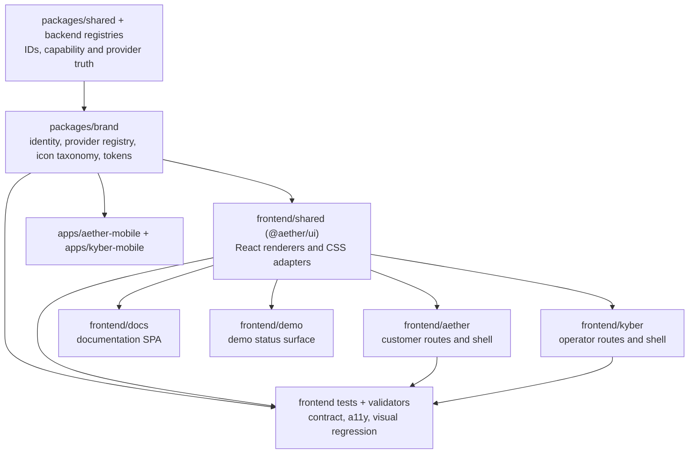

# Olympus Labs / Aether / Kyber visual-system inventory

**Audit date:** 2026-08-08
**Checkout audited:** `/private/tmp/aether-brand-system`
**Branch at audit:** `codex/brand-system-completion` (`f5463cb6`)
**Method:** repository-wide, read-only inventory of application source, public
assets, shared UI, provider contracts, routes, documentation site, demo, mobile
surfaces, and UI test configuration. This is a migration inventory, not a claim
that a source is production-ready.

## Executive conclusion

The repository already has a coherent **Aether** visual basis: the five-layer
mark, the warm/stone dark and light surfaces, Deep Steel / Sky Blue, and Geist
are implemented in `frontend/aether/public/`,
`frontend/aether/src/components/aether-logo.tsx`, and
`frontend/shared/src/styles/tokens.css`. The implementation is not yet an
operating system:

- brand data and asset ownership live only in Aether's public directory;
- Kyber replaces the established palette and typography with a separate,
  explicitly-described "placeholder palette";
- navigation and semantic state rely on ASCII or raw Unicode glyphs rather than
  a typed icon taxonomy;
- provider marks, payment labels, and notification marks each have local,
  incompatible registries;
- graph identity, status, confidence/freshness, radius, shadows, focus, motion,
  and responsive rules are fragmented;
- the documentation site has an unrelated inline blue/gray style; and
- visual, responsive, and accessibility regression coverage is not enforced.

The migration target is therefore a deliberately small `@olympus/brand`
package as the **identity/registry/token source**, with `@aether/ui`
(`frontend/shared/`) as the **React rendering adapter**. Aether, Kyber, docs,
demo, and mobile must consume it without changing routes, backend capability
contracts, or the truthful state language already present.

## Findings by surface

| Surface | Current implementation and evidence | Duplicate / incorrect implementation | Missing implementation | Migration target |
| --- | --- | --- | --- | --- |
| Corporate, Aether, and combined identity | Official Aether/Olympus SVGs are in `frontend/aether/public/logo-aether-layers.svg`, `logo-aether-layers-mono.svg`, `logo-olympus-arch.svg`, `lockup-aether-horizontal.svg`, `lockup-olympus-horizontal.svg`, `lockup-combined-dark.svg`, and `favicon-aether.svg`. `frontend/aether/src/components/aether-logo.tsx` recreates the five layers in JSX with the established five colors and Geist wordmark. | The JSX mark duplicates SVG geometry and color literals. Assets are owned by the Aether app even though they are cross-product. The combined lockup has only a dark treatment. | No package-owned identity manifest, no formal Olympus/Aether/Kyber hierarchy, no compact/stacked/light/monochrome policy, and no shared favicon/app-icon manifest. | `packages/brand/src/identity/{olympus,aether,kyber,combined}/`; make `AetherLogo` a compatibility adapter over the canonical asset/lockup API and move/copy assets once with an asset manifest. |
| Kyber identity | `frontend/kyber/public/kyber.svg` is the only static Kyber mark. `frontend/kyber/src/components/layout/sidebar.tsx` renders a text-only `KYBER` heading and `Aether Internal` footer. | `kyber.svg` is a generic dark square with three bars, unrelated to the Aether layers/Arch. The local `KYBER` heading is an independent lockup. | No Kyber lockup derived from Olympus/Aether, responsive reduction rule, dark/light/monochrome policy, or app icon set. | Brand-package Kyber identity manifest; `@aether/ui` `ProductLockup`/`BrandMark` renderer. Preserve its operator/control-plane tone without creating a third corporate identity. |
| Aether app shell and navigation | `frontend/aether/src/components/app-shell.tsx` contains the actual customer navigation and uses `resolveDestinationAvailability` for backend capability/flag gating. | Each entry uses bracketed ASCII strings such as `[u]`, `[g]`, and `[ai]` through `frontend/shared/src/components/glyph-icon.tsx`. Two entries share `[s]`, making the visual semantic ambiguous. | Typed navigation icon IDs, icon sizes, tooltip/accessible-name standard, compact/mobile nav behavior, and a single source for action/navigation iconography. | `packages/brand/src/iconography/navigation.ts` plus shared `Icon`/`NavIcon`; retain all paths, labels, `requirement`, and availability behavior exactly. |
| Kyber app shell and navigation | `frontend/kyber/src/components/layout/sidebar.tsx` is the actual operator navigation and preserves both capability and `envFlag` gates. `frontend/kyber/src/components/layout/top-bar.tsx` includes environment/live state and notifications. | Sidebar uses raw Unicode (`◈`, `⬡`, `⚑`, `⌘`, `✓`, etc.); top bar uses a raw envelope and left-arrow. Those glyphs are font-dependent and are not a semantic icon system. | Same navigation taxonomy as Aether, a compact operator lockup, standard icon-control hit area/focus handling, and safe responsive shell behavior. | Shared icon renderer consuming `@olympus/brand`; migrate sidebar/top bar presentation only. Do not infer permissions from routing and do not alter the current per-page forbidden-state behavior. |
| Typography and core color tokens | `frontend/shared/src/styles/tokens.css` declares Aether's warm dark/light surfaces, Deep Steel `#3a6896`, Sky Blue `#5a85a8`, Amber, Rose, Sage, Geist, and Geist Mono. `frontend/aether/src/styles/tokens.css` explicitly says it has no overrides. Both product apps use `frontend/shared/tailwind.preset.js`. | `frontend/kyber/src/styles/tokens.css` duplicates root/dark/light theme variables with a cold blue/purple palette, Inter plus JetBrains Mono, and 12 controller colors. `frontend/kyber/src/pages/intelligence-os/styles.css` contains a third, standalone palette/radius system. The docs UI uses inline `system-ui` and blue/gray hex values in `frontend/docs/src/components/{Layout,Sidebar,DocPage}.tsx`, `frontend/docs/src/pages/{DocIndex,DocViewer}.tsx`. | Semantic color aliases that separate product brand from state, documented typography scale/line height/weight, cross-app theme contract, and tokenized typography. | `packages/brand/src/tokens/{typography,brand-spacing,radius,border,focus}.ts` plus generated/shared CSS variables. Map Kyber controller/chart values to semantic domain/state aliases instead of retaining a competing base palette. |
| Provider identity | Auth logos exist only in `frontend/shared/src/components/social-provider-icon.tsx` for `google`, `apple`, `slack`, `microsoft`; Aether login consumes those marks in `frontend/aether/src/pages/login/login-page.tsx`. `frontend/kyber/src/features/notifications/channel-type-icon.tsx` independently inlines Slack/Discord/Telegram SVGs and raw Tailwind brand colors. Payment labels are a text-only local map in `frontend/aether/src/pages/payment-rails/payment-rails-shared.tsx`. | At least three visual provider vocabularies, no shared provider type, inline third-party paths/colors, fixed `w-4 h-4` login size, and no policy for generic webhooks, aliases, monochrome marks, attribution, or fallback initials. | Canonical provider IDs/aliases/categories, local owned marks, trademark/attribution metadata, neutral technical-provider treatment, and provider sizing rules. | `packages/brand/src/providers/{types,registry,categories,attribution,marks}`; one `ProviderMark` renderer in `frontend/shared/`. The source ID remains owned by the existing backend/shared contracts. |
| Entity, graph, confidence, provenance, and freshness | Entity types and Profile360/graph values are explicit in `frontend/kyber/src/types/entities.ts`; `frontend/shared/src/components/freshness-indicator.tsx`, `status-indicator.tsx`, and `frontend/shared/src/status/capability-state.ts` preserve labels and truthful lifecycle semantics. Graph runtime mechanics already live in `frontend/shared/src/graph/`. | Aether and Kyber both maintain local Cytoscape style maps in `frontend/aether/src/components/graph/graph-canvas.tsx` and `frontend/kyber/src/components/graph/graph-canvas.tsx`, including literal colors and shapes. Both path inspectors duplicate raw Unicode classification symbols in their `components/graph/path-inspector.tsx` files. Several score thresholds are repeated as literals. | Entity/domain icon registry; non-color confidence, risk, provenance, and freshness indicators; shared graph style/token adapter; graph icon and overlay size contract. | `packages/brand/src/iconography/{entities,domains,status,severity,freshness,confidence,provenance}.ts`; migrate shared graph rendering to consume semantic style tokens. Keep the existing labels, backend scores, and state thresholds unless a product contract changes them. |
| States, empty/loading/error, severity | `frontend/shared/src/status/capability-state.ts` is a strong existing truthful state matrix; `capability-state-badge.tsx` preserves label, description, machine-readable `data-capability-state`, and non-live status. `severity-badge.tsx`, `status-indicator.tsx`, `freshness-indicator.tsx`, `loading-state.tsx`, `empty-state.tsx`, `error-state.tsx`, and `skeleton.tsx` are shared baseline components. | These components rely on untyped `size?: 'sm' | 'md'`, raw glyphs (`∅`, `⚠`, `↻`, lifecycle symbols), and literal icon text rather than an icon token. `StatusIndicator` has an `aria-label` on a colored dot but no role or programmatic status association when no visible label is supplied. | Semantic state icon registry, icon-size/hit-target policy, ARIA semantics for icon-only meaning, standardized stale/refresh presentation, and guidance for charts/graphs not to rely on color. | Preserve the lifecycle matrix in `@aether/ui`; replace decorative/semantic glyph output with named icons from the brand taxonomy and retain its text labels/data markers. |
| Motion, elevation, surfaces, and focus | Global reduced-motion overrides exist in `frontend/aether/src/styles/index.css` and `frontend/kyber/src/styles/index.css`. Shared button focus has a visible `focus-visible` ring in `frontend/shared/src/components/button.tsx`. `frontend/kyber/src/pages/intelligence-os/styles.css` contains a local focus style and reduced-motion section. | There are no centralized duration/easing/elevation/shadow tokens. Direct `shadow-*`, transition, animation, radius, and focus choices occur throughout features; `intelligence-os` has a parallel, page-local visual system. | Tokenized duration/easing/spring/reduced-motion recipes, elevation/overlay recipes, density/radius policy, and regression tests that honor reduced motion. | `packages/brand/src/{motion,surfaces,tokens}`; shared UI consumes recipes. Keep the current global reduced-motion guard while centralizing its source values. |
| Responsive behavior | Individual product features use Tailwind breakpoints; `frontend/kyber/src/pages/intelligence-os/styles.css` has responsive breakpoints at 1180/980/720px. The Aether and Kyber app shells currently use fixed-width sidebars (`w-56`, `w-52`). | No brand lockup/density responsive system. Docs sidebar is fixed at 240px in inline styles; no audited small-viewport alternative. Intelligence OS has local breakpoints not reusable elsewhere. | Responsive logo/lockup reductions, shell breakpoint contract, dense-table/icon sizing policy, and small viewport regression suite. | `packages/brand/src/responsive/{lockup,logo,density}.ts`; app-specific layout stays local but consumes the common breakpoints and lockup states. |
| Marketing, docs, demo, and metadata | There is no separate marketing/landing application in the workspace list. The docs SPA is `frontend/docs/`; demo is `frontend/demo/`; repository marketing-like images are only `docs/images/ai-referral-attribution/*.jpg`. The committed visual asset inventory contains the seven Aether assets above, `frontend/kyber/public/kyber.svg`, and two documentation JPGs. | Docs uses an independent inline blue/gray system and plain "Aether Docs" text. Demo uses shared UI but a text-only header. No canonical brand imports, no known OpenGraph image pipeline, and no docs/marketing lockup composition. | Brand guide, documented logo use/clear space, docs theme, public metadata/favicons/OG variants, marketing templates, asset ownership/duplication validation. | Brand-owned assets/manifests; docs and demo consume shared components/tokens; add a source-authored `docs/brand-system/guide.md` later in the documentation slice. |

## Canonical visual foundations to preserve

These are the implementation facts the migration must preserve, rather than
reinterpreting the product:

1. **Aether layered mark:** five stacked diamond-like layers, with Deep Steel,
   Sky Blue, Amber, Rose, and Sage. Source evidence:
   `frontend/aether/public/logo-aether-layers.svg` and
   `frontend/aether/src/components/aether-logo.tsx`.
2. **Olympus relationship:** the existing `lockup-combined-dark.svg` explicitly
   composes **Olympus Labs · Aether**; Olympus remains parent attribution, not
   normal-screen chrome.
3. **Warm/stone application language:** shared CSS uses warm neutral surfaces
   and `#e8e6e1`-leaning foregrounds, not generic blue/gray application chrome.
4. **Product typography:** Geist and Geist Mono are the current shared product
   stack. Preserve Aether's sans-led customer density and Kyber's useful
   operator monospace hierarchy without allowing Inter/JetBrains to redefine
   brand typography.
5. **Truthful capability semantics:** capability labels, descriptions,
   non-live behavior, and machine-readable markers in
   `frontend/shared/src/status/capability-state.ts` and
   `frontend/shared/src/status/capability-state-badge.tsx` are behavioral
   contracts. A visual migration may improve their rendering; it must not make
   a credential-gated, sandbox, stale, degraded, disabled, or failed source
   look live.

## Canonical provider inventory and ownership

There is no single visual provider registry today. The following list is the
required input to the new registry; it deliberately separates **runtime source
of truth** from **visual presentation**. A visual registry must not create new
backend provider IDs or silently normalize them in API calls.

| Provider family | Canonical IDs/names to cover | Runtime/contract evidence | Current visual evidence | Required registry treatment |
| --- | --- | --- | --- | --- |
| Authentication | `google`, `apple`, `slack`, `microsoft` | `frontend/shared/src/components/social-provider-icon.tsx`; Aether login configuration in `frontend/aether/src/pages/login/login-page.tsx` | Inline SVG paths only; fixed 16px styling. | Official/local marks with `authentication` category; retain accessible provider button names. |
| Payment rails | `privy`, `stripe`, `coinbase`, `moonpay`, `bridge` | `packages/shared/payment-rails.ts`; strict backend mirror `Backend Architecture/aether-backend/services/integrations/providers/payment_rails/__init__.py` | Text labels in `frontend/aether/src/pages/payment-rails/payment-rails-shared.tsx`; present in Aether and Kyber rail views. | `payments` category. Provider mark may be compact, but observed/custody-free state must stay more prominent than the mark. |
| Tenant connectors / consent catalog | `slack`, `generic_webhook`, `shopify`, `stripe`, `hubspot`, `salesforce`, `klaviyo`, `sendgrid`, `customerio`, `mailchimp`, `postmark`, `segment`, `posthog`, `ga4`, `jira`, `linear`, `zendesk`, `intercom`, `dune`, `apple_pay`, `google_pay`, `outbound_activation`, `iterable`, `braze` | `packages/shared/contracts/integration-consent-registry.json`; runtime descriptors `Backend Architecture/aether-backend/services/integrations/connectors/registry.py` | Connector rows in `frontend/aether/src/pages/connectors/connectors-page.tsx`; onboarding and Kyber connector tests use catalog names. | Categorize by actual contract (communications, commerce, analytics, delivery, etc.). Treat generic webhook/outbound activation as **technical Aether integrations**, not third-party trademarks. Map `generic_webhook` to runtime `webhook` only in display/alias metadata; do not alter API IDs. |
| Notification channel adapters | `slack`, `discord`, `telegram`, `webhook` | `Backend Architecture/aether-backend/services/notification_intelligence/channel_gateway.py`; channel typing in `frontend/kyber/src/features/notifications/channel-type-icon.tsx` | Local inline Slack/Discord/Telegram marks and hard-coded colors in Kyber. | Reuse provider registry where it is a real provider; render the webhook as a neutral system icon. |
| Olympus source catalog: on-chain / market | `dune_api`, `dune_datashare`, `dune_sim`, `defi_llama`, `coingecko`, `coinmarketcap`, `etherscan`, `the_graph`, `flipside_crypto`, `covalent_goldrush`, `alchemy`, `moralis`, `transpose`, `solscan`; `binance_public`, `coinbase_exchange`, `kraken`, `okx`, `bybit`, `ccxt`; `polymarket_gamma`, `polymarket_clob`, `kalshi`, `metaculus`, `manifold_markets` | Structured catalog in `Backend Architecture/aether-backend/services/provider_catalog/catalog.py`; broader adapter categories in `Backend Architecture/aether-backend/shared/providers/categories.py`; generated view `docs/_generated/providers.json`. | No common frontend provider-mark treatment found. | `blockchain`, `analytics`, `market-data`, or `prediction-market` categories. These entries are candidate/controlled-provider inventory, not proof each should appear in tenant UI. |
| Olympus source catalog: social / identity / protocol | `farcaster_neynar`, `lens_protocol`, `ens_public`, `snapshot`, `github_api`, `twitter_x`, `reddit`, `telegram_bot`, `discord_bot`; `uniswap_subgraph`, `aave_subgraph`, `chainlink_price_feeds`, `opensea`, `reservoir`, `token_terminal` | Same provider catalog. `docs/source-of-truth/OLYMPUS_PROVIDER_SOURCE_CATALOG.md` documents policy posture. | No common mark implementation found. | `social`, `identity`, `governance`, and `blockchain` categories. Keep compliance-disabled status out of normal selectable UI; the provider registry may hold metadata but cannot enable it. |
| External communication/delivery and billing names in documentation | Slack, Linear, Jira, generic Webhook, Agent Assist; Stripe and the connector set above | `docs/CONNECTOR-SUPPORT-MATRIX.md`; billing adapter code under `Backend Architecture/aether-backend/services/billing/providers/` | Documentation only; no docs visual-provider standard. | Documentation should use the same label/mark/attribution contract where it renders a provider, but prose must remain readable if an asset is unavailable. |

### Provider list reconciliation rules

- `packages/shared/contracts/integration-consent-registry.json` and
  `packages/shared/payment-rails.ts` are authoritative for user-facing runtime
  IDs. The new visual package is a mapping layer, not a replacement enum.
- `Backend Architecture/aether-backend/services/provider_catalog/catalog.py` is
  authoritative for the controlled Olympus source inventory. Many entries are
  scaffolded, credential-gated, planned, or compliance-disabled; registry
  presence does **not** grant UI visibility or imply an operational claim.
- `docs/_generated/providers.json` is generated evidence and must not become a
  hand-maintained visual registry.
- Every mapped real provider needs an approved local mark or neutral fallback
  initials. Do not remote-load marks, recreate an unofficial mark, or use a
  generic provider color as a substitute for contractual provider identity.

## Actual application routes and migration coverage

### Aether customer application

`frontend/aether/src/app/router.tsx` is authoritative. Public/auth/legal
surfaces are `/callback`, `/login`, `/signup`, and `/legal/data-retention`.
All remaining routes are authenticated inside the Aether app shell.

| Route family | Actual paths | Visual migration target | Preserve |
| --- | --- | --- | --- |
| Entry and account | `/`, `/activation`, `/onboarding`, `/settings`, `/settings/notifications`, `/notifications`, `/billing`, `/usage-plan`, `/me`, `/security`, `/system-status`, `/data-quality` | `@aether/ui` shell, identity, form/control, status, loading/empty/error primitives | Auth, session, capability, backend error, and settings behavior. |
| People and journey | `/users`, `/users/:id`, `/users/:profileId/journey`, `/clusters/:clusterId`, `/geo`, `/geo/:level/:geoId` | Entity/profile identity, timeline/freshness/provenance and graph primitives | Profile IDs, time semantics, score/causality facts. |
| Campaign/intelligence | `/campaigns`, `/campaigns/:id`, `/campaign-intelligence`, `/campaign-intelligence/registry`, `/campaign-intelligence/sources`, `/campaign-intelligence/mapping-review`, `/campaign-intelligence/quality`, `/campaign-intelligence/campaigns/new`, `/compare`, `/noesis`, `/suggestions`, `/value-review`, `/ai-efficiency` | Entity/domain icons, evidence, confidence, semantic state and charts | Existing data-truth/loading/permission states and feature paths. |
| Graph and operations | `/graph`, `/imports`, `/imports/:id`, `/deployments`, `/deployments/:id`, `/audit-exports`, `/agent-access`, `/interoperability`, `/interoperability/messages/:messageId` | Shared graph style, nav/action icons, status/provenance indicators | API contracts, command/action semantics, route parameters. |
| Connectors, delivery, financial | `/integrations`, `/delivery`, `/payment-rails`, `/rewards`, `/rewards/decisions`, `/rewards/approval-queue`, `/rewards/rails`, `/rewards/campaigns/new`, `/stablecoins`, `/stablecoins/:assetId`, `/derivatives`, `/derivatives/accounts/:accountId` | Provider mark, capability badge, payment/rail and warning/freshness primitives | Connector IDs, capability gates, no-custody wording, health/reconciliation state, financial facts. |

The nav source is intentionally smaller than the route map. Retain this
distinction and retain `resolveDestinationAvailability` behavior in
`frontend/aether/src/components/app-shell.tsx`.

### Kyber operator application

`frontend/kyber/src/app/router.tsx` is authoritative. Do **not** use
`frontend/kyber/src/routes/index.ts` as the brand migration inventory: it is a
partial helper/legacy map and omits routes.

| Route family | Actual paths | Visual migration target | Preserve |
| --- | --- | --- | --- |
| Auth and special workspace | `/callback`, `/intelligence-os` | Kyber lockup, responsive workspace, named icon renderer, shared tokens | Intelligence OS is a special full-viewport route; its behavior and focus management remain intact. |
| Core operating plane | `/mission`, `/live`, `/command`, `/review`, `/lab`, `/diagnostics`, `/kyber-commands`, `/kyber-exceptions`, `/reliability`, `/deployment-readiness`, `/implementation` | Operator shell, nav/action/status taxonomy, state surfaces | Capability/authority truth and all route labels. |
| Intelligence/entities/graph | `/noesis`, `/noesis/fleet-graph`, `/noesis/graph-explorer`, `/entities`, `/entities/:type/:id`, `/profile360/:type/:id`, `/kyber-graph`, `/tenant-mirror`, `/intelligence-quality`, `/journey-health`, `/investigations`, `/fraud-networks`, `/fraud-networks/flow-trace` | Entity, graph, confidence, freshness, provenance and evidence primitives | Tenant/fleet scope, entity types, score/risk semantics. |
| Measurement, delivery, connectors | `/measurement/*`, `/connectors`, `/dune-feeder`, `/imports`, `/imports/:id`, `/delivery`, `/agent-telemetry` | Provider marks, dense tables, chart/state tokens, responsive layout | Runtime connection/health and delivery semantics. |
| Financial, security, governance | `/payment-rails`, `/stablecoins/ops`, `/derivatives/ops`, `/interoperability/ops`, `/rewards/*`, `/security/*`, `/tenants`, `/agent-access`, `/targeting`, `/revops`, `/sales-readiness`, `/pricing-architecture`, `/gtm-materials`, `/buyer-personas`, `/roi-calculators` | Payment/provider visuals, severity/provenance/state system | Operator permissions, environment flags, action guards, financial truth. |

### Provider/authority preservation boundary

These are **not styling details** and must be regression-tested before and
after the migration:

- Aether's provider tree in `frontend/aether/src/app/providers.tsx` derives
  exploration identity from authenticated backend user/tenant identity, then
  passes actual path/search context to the exploration layer. Coverage:
  `frontend/aether/src/app/providers.test.tsx`.
- Kyber's provider tree in `frontend/kyber/src/app/providers.tsx` uses active
  backend tenant scope or an operator/session fleet identity. Coverage:
  `frontend/kyber/src/app/providers.test.tsx`.
- Kyber navigation must retain its `requirement` and `envFlag` conditions in
  `frontend/kyber/src/components/layout/sidebar.tsx`; a route is never an
  authorization grant.

## Dependency map

**Dependency rules**

1. `packages/brand` may import types/IDs from `packages/shared` only where
   necessary to guarantee exact mapping; it must not import React or route
   code, and must not become a component library.
2. `frontend/shared` imports `@olympus/brand` and owns React/SVG rendering,
   accessibility behavior, sizing, and Tailwind/CSS adaptation.
3. Aether/Kyber/pages do not define provider marks, navigation glyphs, base
   palette values, or visual state glyphs locally after their migration slice.
4. Backend/shared provider IDs, entity types, capability states, permission
   gates, and route behavior remain the sources of truth. Brand metadata may
   add labels/aliases/attribution, never authority.
5. Docs/demo/mobile may use the source package directly for non-React
   metadata or the shared layer for React presentation; they must not clone
   assets/tokens.

## Test and accessibility inventory

### Existing useful coverage

- App provider/authority contract: `frontend/aether/src/app/providers.test.tsx`
  and `frontend/kyber/src/app/providers.test.tsx`.
- State vocabulary: `frontend/shared/src/status/capability-state.test.tsx` and
  the many Aether/Kyber route-state tests under `frontend/*/src/test/`.
- Connector/provider behavior: `frontend/aether/src/test/unit/connectors-page.test.tsx`,
  `frontend/aether/src/test/unit/payment-rails-page.test.tsx`,
  `frontend/kyber/src/test/component/connectors-page.test.tsx`, and
  `frontend/kyber/src/test/component/payment-rails-page.test.tsx`.
- Basic browser/auth smoke: `frontend/aether/src/test/e2e/onboarding.spec.ts`,
  `frontend/kyber/src/test/e2e/smoke.spec.ts`, and the respective Playwright
  configs.
- Explicit reduced-motion CSS exists in both product global styles; several
  controls supply labels/roles and shared `Button` has a focus-visible ring.

### Gaps that QA/enforcement must close

| Gap | Evidence | Enforcement target |
| --- | --- | --- |
| No visual screenshot baseline | Playwright configs run Desktop Chrome only and the audited E2E specs contain no screenshot assertions. | Add deterministic Aether/Kyber/docs screenshots for shell, auth, connectors, payment rails, Profile360/graph, empty/loading/error, and Intelligence OS at desktop and narrow viewport. |
| No automated axe-style accessibility gate found | Current tests use Testing Library roles but no repository accessibility matcher/gate was found. | Add targeted automated semantic checks plus keyboard/focus/manual contrast review; do not treat icon snapshots as accessibility proof. |
| Icon-only / color-only risk | ASCII/Unicode icons appear in nav and state components; graph score overlays use colors/literal styles; some raw icon spans depend on a title rather than named control behavior. | Static validator prohibits `GlyphIcon` and raw production nav/state glyphs after migration; require a label, accessible name, or adjacent text for semantic icons. |
| Token and asset drift | 347 frontend color literal occurrences, local Kyber palettes, page-local Intelligence OS tokens, and marks in components. | Validator permits brand color literals only in canonical brand assets/token source and approved test fixtures; detect duplicate provider/brand SVG paths outside registry. |
| Responsive coverage | App sidebars/docs sidebar have fixed widths; only Intelligence OS owns complete local media queries. | Route-family viewport matrix and lockup-density tests; include overflow, keyboard focus, and 44px interactive target checks. |
| Reduced-motion coverage | CSS guard exists but no test asserts it; `Skeleton` uses `animate-pulse`. | Test motion recipes under `prefers-reduced-motion`; ensure loaders preserve an accessible loading state. |

## Sequenced PR-train ledger

The following order avoids overlapping ownership and keeps the existing
`codex/brand-system-completion` branch reviewable. A later slice must rebase on
the accepted predecessor and must not silently fold its scope back into an
unrelated feature change.

| Slice | Owner | Files/scope owned | Dependencies | Acceptance evidence |
| --- | --- | --- | --- | --- |
| 0. Audit and architecture | Brand Systems Lead / inventory | This audit; master implementation ledger | None | Provider/route/asset reconciliation signed off. |
| 1. Brand source of truth | Brand Architecture | `packages/brand/`, workspace registration, official asset normalization, public TS API | Slice 0 | Type tests for identity/provider/icon/token APIs; no React import in package. |
| 2. Shared rendering layer | Shared UI | `frontend/shared/` brand adapters: lockup, named icon, provider mark, semantic-state and token integration | Slice 1 | Component/a11y tests; compatibility adapter tests for existing capability states. |
| 3. Aether migration | Aether owner | `frontend/aether/` shell, auth/onboarding, connectors, payment rails, graph/profile, state surfaces | Slices 1–2 | Route/authority tests unchanged and green; no production ASCII navigation glyph or local provider mark; targeted screenshots. |
| 4. Kyber migration | Kyber owner | `frontend/kyber/` shell, operator/product lockup, notifications, graphs/entities, payment/connectors, Intelligence OS token adoption | Slices 1–2 | Scope/capability tests unchanged and green; no raw nav glyphs; special Intelligence OS responsive/a11y screenshots. |
| 5. Docs/demo/mobile/metadata | Marketing & Documentation owner | `frontend/docs/`, `frontend/demo/`, mobile brand entry points, favicon/metadata and brand guide | Slices 1–2 | Docs theme/accessibility checks, no duplicated assets, applicable mobile tests. |
| 6. Enforcement and certification | QA / Enforcement | validators, lint/static scans, visual/a11y/responsive tests, CI wiring | Slices 1–5 | Clean scan, targeted test matrix, `make docs-fix`, then canonical `make ci-check`. |

### Current branch ledger context

At audit time, this branch is four commits ahead of `origin/main` and its head
contains `feat(kyber): add intelligence operating system workspace (#518)`.
That route is a **migration consumer**, not an excuse to introduce another
brand system. Current worktrees are concurrent; each implementation slice must
re-read HEAD before commit and keep ownership non-overlapping.

## Explicitly allowable transitional exemptions

These exemptions are narrow, temporary, and must be recorded in the migration
scan with an owner and removal slice. They are not permission to retain a second
brand system.

1. **Compatibility components may remain only as delegates.**
   `frontend/aether/src/components/aether-logo.tsx` and
   `frontend/shared/src/components/social-provider-icon.tsx` may keep their
   exported API during staged adoption, but after their owning slice they must
   delegate to the shared brand renderer and contain no independently-maintained
   SVG geometry, path table, or size policy.
2. **Provider fallback is permitted where an official local mark has not been
   approved.** Use the registry's neutral initials/system treatment, a visible
   label, and attribution metadata. Never fetch a remote mark, invent a mark,
   or put a third-party color in place of an identity decision.
3. **Technical integrations are not trademarks.** `generic_webhook`, runtime
   `webhook`, `outbound_activation`, and other Aether technical adapters may
   use neutral system marks permanently. The registry must preserve their exact
   technical IDs and aliases.
4. **The specialized Intelligence OS may migrate in two passes.** Its layout,
   focus management, and route can remain local while its values are first
   mapped to canonical CSS variables. Its duplicate palette, radius, motion,
   and icon vocabulary must be removed by the Kyber slice; it cannot remain an
   unbounded permanent exception.
5. **Backend/contract names and truthful status wording are not visual debt.**
   Existing IDs, labels such as `credential_required` / `partner_live`,
   capability gating, provider state, and permission behavior must remain until
   their contract owners approve changes. The visual layer maps these values;
   it does not rename, merge, or greenwash them.
6. **Test fixtures and generated documentation are exempt from production
   asset rules only when clearly test/generated.** They must not be imported by
   runtime UI. Generated material (including `docs/_generated/providers.json`)
   remains generated and is never manually changed to satisfy visual migration.

## Definition of done for visual-system completion

- `@olympus/brand` owns the canonical public identity, provider, icon, token,
  responsive, surface, and motion data with a small, typed API.
- `@aether/ui` is the only React rendering layer for those primitives.
- Aether, Kyber, docs, demo, and mobile consume the shared source; no
  feature-local brand/provider assets, local base palette, or production
  ASCII/Unicode navigation/state glyph systems remain.
- Every actual Aether/Kyber route family is covered by the migration matrix;
  route, authority, capability, and data-truth contracts remain unchanged.
- Provider visual coverage includes every runtime provider actually rendered,
  with safe fallbacks and attribution rules; catalog-only/disabled providers do
  not gain unjustified visibility.
- Focus, reduced motion, semantic state labels, non-color cues, interactive
  target sizing, and responsive lockup behavior are verified.
- Validators block token drift, raw production glyph navigation, duplicate
  provider/brand assets, remote logo loads, and bypasses of the canonical
  registry.
- Required repository documentation is regenerated and the final integration
  passes `make docs-fix` followed by `make ci-check`; hosted CI is separately
  verified before any remote completion claim.
