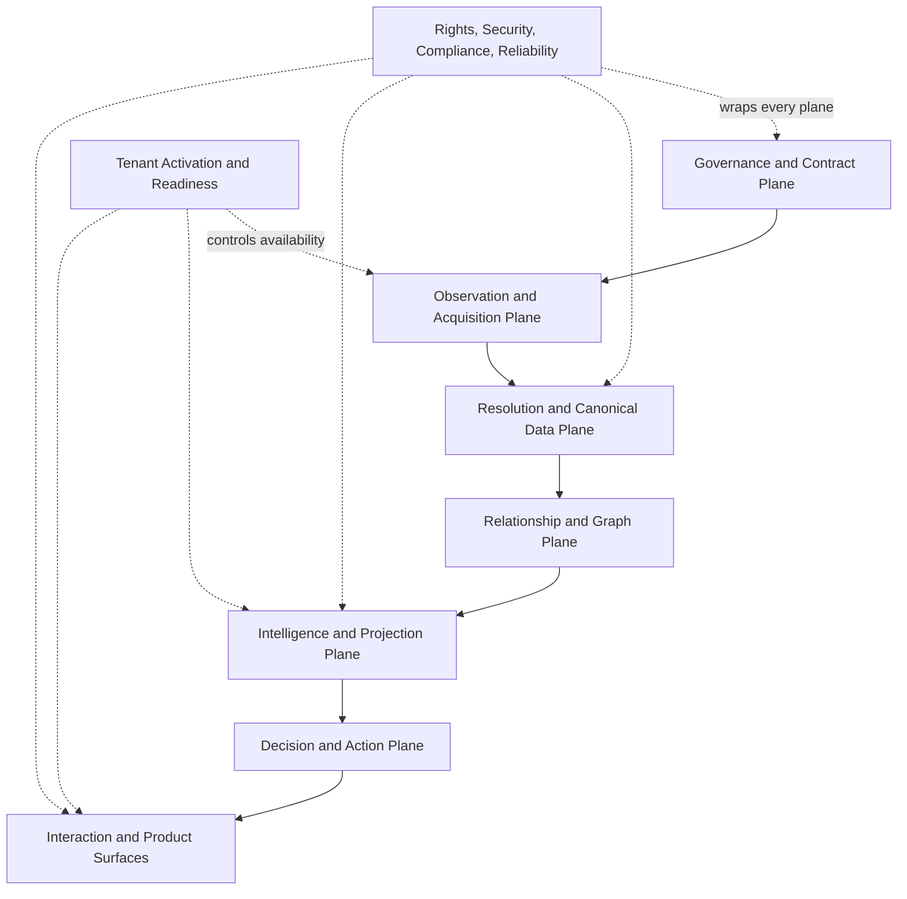
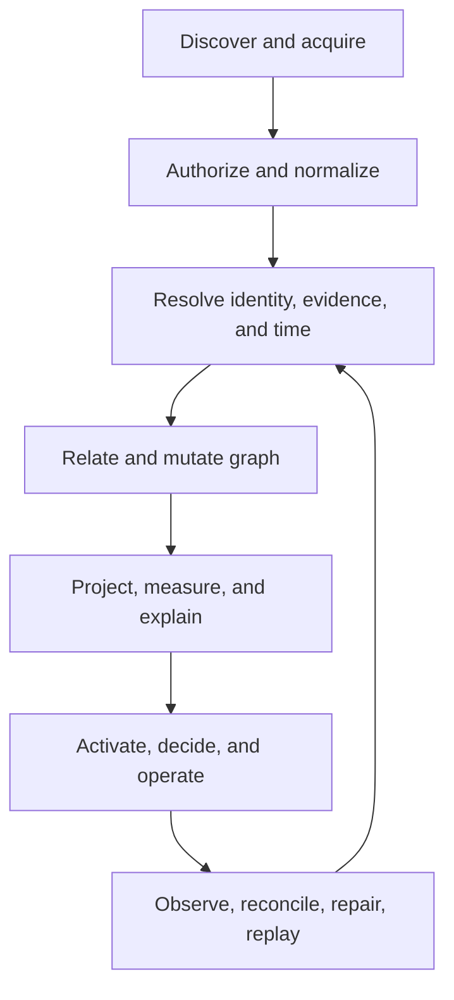

# Repo Grounding — filing annex for the Spine P0 architecture

This file is the **canonical source of truth** for the *Aether Spine P0 — Ground
Zero Founding Spine* architecture. It holds two parts:

1. **This leading repo-grounding annex** — reconciles the architecture's
   vocabulary against the actual repository, states plainly what exists and
   what does not, and pins the decision record and ledgers.
2. **The founding architecture document, verbatim** — *Aether Spine P0 —
   Architecture Placement, Operation & Value* (2026-08-24), reproduced
   byte-for-byte from its own title line in the section below.

The decision that adopts this architecture is
[ADR-011: Spine Composition Kernel](../decisions/ADR-011-spine-composition-kernel.md).
The phased program that implements it is
[SPINE_P0_PHASES.md](../plans/SPINE_P0_PHASES.md). The honest per-artifact
ledger of what has actually shipped is
[SPINE_REGISTRY_STATUS.md](./SPINE_REGISTRY_STATUS.md). This annex governs —
it is the glossary that later docs must reuse, never fork.

## Grounding

- **Classification**: source-of-truth document, `status: experimental`
  (filed verbatim as the ground-zero *target* architecture; see Honesty).
- **Canonical owner**: `platform@aether`.
- **Relation to the contract spine**: this architecture is implemented
  **inside** the existing Truth Kernel machinery (`packages/shared/*.ts`,
  `packages/shared/contracts/*.json`, Pydantic mirrors, generation gates),
  never beside it.
- **Relation to ADR-010**: the Intelligence Projection Plane
  (`ADR-010-intelligence-projection-plane.md`) already governs "a 360 is a
  projection, never a system of record." This architecture generalizes that
  doctrine upward: a *spine* is a governed authority, never a private
  platform.
- **Relation to existing "spine" meanings**: the repo already uses the word
  "spine" three ways — (1) the Truth Kernel **contract spine**, (2) the
  projection plane's **hard-spine vocabulary** (`SPINE_INDEX` /
  `pendingAuthority {kind:"spine"}`), and (3) an unrelated ops "control
  spine." ADR-011 reconciles all three. This annex maps the doc's terminology
  onto them.

## Terminology reconciliation

`Doc term` | `Repo component / registry` | `Status`

| Doc term (Spine P0) | Repo component / registry | Status |
| --- | --- | --- |
| Contract Spine | Truth Kernel canonical-schema layer: `packages/shared/*.ts` contracts, `packages/shared/contracts/*.json` registries, Pydantic mirrors, unbypassable generation/validation gates (`scripts/generate_contracts.py`, `scripts/generate_platform_contracts.py`, `scripts/validate_contracts.py`, `scripts/repo_doctor.py --ci`) | EXISTS |
| Spine Composition Registry / spine-registry | Canonical machine-readable registry: `packages/shared/contracts/spine-registry.json` (34 governed rows — 25 `implemented`, 7 `in_flight`, 2 declared `pending`), validated by `scripts/validate_spine_registry.py` on every `make ci-check`; the projection plane now derives its `SPINE_INDEX` (32 resolved) / `PENDING_SPINE_INDEX` (2) from it | EXISTS (Phase 2; the kernel) |
| Spine Composition Kernel (envelope · adapters · lifecycle · conformance · mutation policy · evidence · temporal · readiness) | Registry + common envelope + lifecycle/mutation-policy/conformance vocabulary composed inside the contract spine: `spine-registry.json`, `validate_spine_registry.py`, `spine-envelope.ts` + mirror, generated TS/PY/MD twins | PARTIAL — kernel machinery shipped (Phases 2–6); per-spine conformance not yet verified |
| Common spine envelope | `packages/shared/spine-envelope.ts` + backend mirror (`shared/spine/spine_envelope.py`) composing canonical primitives; `identity_watermark` / `rights_decision_ref` declared `@unpopulated` (no producer yet) | PARTIAL (Phase 3) |
| IRRL / Rights Runtime (`DataRightsEnvelope`, `UseAuthority`, `DerivationClass`, `RetentionPolicy`, `Generalization Gateway`, `RightsDecision`) | Rights machinery under existing non-IRRL names: `services/integrations/data_rights` (`DataRightsGrant`, `model_training_allowed`), `services/policy` (`ConsentPolicyDecision`), `services/dsr_propagation`, `services/storage_lifecycle`, source-of-truth ledger `DATA_RIGHTS_LEDGER.md` — mapped onto IRRL terms by the naming overlay (`docs/source-of-truth/IRRL_NAMING_OVERLAY.md`); `rights_irrl` + `irrl_naming_overlay` governed rows reference, never fork, these registries | PARTIAL — machinery + naming overlay shipped (Phase 5); envelope rights fields `@unpopulated` |
| Universal Provider Runtime | Provider-runtime machinery; universal provider runtime (ADR-009/ADR-008 precedents); connector normalization + SDK alignment | EXISTS |
| Identity Resolution | Identity-resolution authorities (`EntityRef` / unresolved state) | EXISTS |
| Temporal Kernel | Temporal kernel + bitemporal ledger; event/ingestion/valid/system time, watermark, replayable history | EXISTS |
| Evidence / Lineage / Truth-State / Restatement | Evidence manifest + provenance / restatement / truth-state machinery | EXISTS |
| Context Capsule | `ContextCapsule` contract | EXISTS |
| Graph Mutation / State Transition / History | Graph Mutation Gateway (`MutationIntent` → `GraphMutationGateway.apply`) + graph layer / state-transition history | EXISTS |
| Relational Intelligence / Relationship Fidelity | Relationship-fidelity layer(s) — observed / inferred / trust / risk / causal association semantics | EXISTS |
| Measurement / Metrics / Algebra | `metric-registry.json` + measurement/outcome contracts | EXISTS |
| Lens / Projection Algebra; Exploration Fabric | Intelligence Projection Plane (ADR-010) + exploration fabric | EXISTS |
| 360 projections | Nineteen 360 projections in `intelligence-projection-registry.json` (three `implemented` on the 360-foundation base — `outcome360`/`economic360`/`infrastructure360`; the rest `in_flight`/pending) | EXISTS |
| Consent / Privacy / Deletion | `consent-registry.json`, `services/policy` (`ConsentPolicyDecision`), DSR propagation / deletion | EXISTS |
| Kyber | Kyber operator control surface (desired state, observed state, remediation, control workflows) | EXISTS |
| Noesis | Noesis product surface (Interaction and Product plane) | EXISTS |
| Graph-of-Graphs rights filtering | Data-use doctrine only (`GRAPH_OF_GRAPHS_DATA_USE.md`, `AETHER_GRAPH_OF_GRAPHS_POLICY_ENABLED`); no rights-filtered intelligence-layer enforcement yet | PARTIAL |
| 14-item conformance contract | In-registry conformance contract: every non-program spine row carries its 14 checks (all `open`), structurally enforced by `validate_spine_registry.py`; `SPINE_P0_CONFORMANCE_CHECKLIST.md` maps the 14 items to evidence | PARTIAL — contract + gate shipped (Phase 6); no row verified |
| Tenant Activation & Readiness | Readiness vocabulary (presentation-only join, never emits certification/`production_ready`), activation machinery, capability manifest | EXISTS |

## Honesty — what does and does not exist yet

This architecture is filed **verbatim as the ground-zero founding target**. The
repo-grounding annex above is this program's own mapping and is updated as the
phased program ships. As of the Phase 1–7 landings (2026-09-03), re-cut as the sibling lane
`feat/spine-p0-foundation` onto the 360-foundation base
`feat/aether-360-program` @ `fced2960` (so the three 360 vertical slices
`outcome360`/`economic360`/`infrastructure360` are already `implemented`
here), the following net-new capabilities **now exist in the repository**,
each landed behind a green `make ci-check`:

- the canonical **spine-registry** (`packages/shared/contracts/spine-registry.json`,
  34 governed rows) and its validator (`scripts/validate_spine_registry.py`,
  wired into repo-doctor as `make spine-registry-check`);
- the **Spine Composition Kernel** as a governed component: registry + common
  spine envelope + lifecycle / graph-mutation-policy / conformance vocabulary
  composed inside the contract spine, with generated TS/PY/MD twins;
- the **common spine envelope** (`packages/shared/spine-envelope.ts` + backend
  mirror), with `identity_watermark` and `rights_decision_ref` declared
  `@unpopulated`;
- the **IRRL naming overlay** (`docs/source-of-truth/IRRL_NAMING_OVERLAY.md`)
  mapping the existing rights machinery onto IRRL terms;
- the **14-item spine conformance contract**, in-registry per row and enforced
  structurally by the validator, with `SPINE_P0_CONFORMANCE_CHECKLIST.md` as
  its evidence mapping.

Still **do not exist** (each is an honest `open` conformance item or a declared
`pending` row in the registry — no `CANONICAL` or `production_ready` claim is
made anywhere):

- verified per-row conformance evidence (every non-program row's 14 checks are
  `open`);
- envelope producers for `identity_watermark` / `rights_decision_ref`
  (`@unpopulated`);
- the two spines the registry marks `pending` (`journey_continuity`,
  `reconciled_control_plane`) as implemented capabilities — and, for the three
  projection spines re-formalized `pending` → `implemented` on the 2026-09-05
  re-cut (`graph_history_replay`, `context_capsule_semantics`,
  `grouping_membership`), the verified per-row conformance evidence (each row's
  14 checks remain `open`);
- rights-filtered **intelligence-layer enforcement** across the
  Graph-of-Graphs boundary.

Where this document says a spine "declares," "evaluates," "assigns," or
"resolves," those are statements of the **target architecture**, not claims
that the behavior runs today. The per-artifact reality ledger is
[SPINE_REGISTRY_STATUS.md](./SPINE_REGISTRY_STATUS.md); the phased program that
closes each gap is [SPINE_P0_PHASES.md](../plans/SPINE_P0_PHASES.md). No doc in
this program may claim a kernel/registry/envelope/IRRL capability "is" shipped
before the code, validator, and a green `make ci-check` exist.

## Glossary of net-new vocabulary

Terms this architecture introduces. Several were net-new at the 2026-09-02
filing and now have repo tokens (kernel, spine-registry, envelope,
conformance — see the terminology table and honesty section above); the rest
remain targets. Each is anchored to its nearest existing relative and to the
phase that ships it.

| Term | Meaning | Nearest existing repo token | Ships / landed in |
| --- | --- | --- | --- |
| Spine Composition Kernel | The P0 contribution: registry + envelope + lifecycle + conformance composed inside the Contract Spine | contract-spine gates (`scripts/repo_doctor.py`, `scripts/validate_contracts.py`) | ADR-011; phases 2–6 |
| spine-registry | One canonical machine-readable registry of spine identity/owner/ports/deps/mutation policy/lifecycle/readiness/conformance; references, never re-defines, owning registries | `intelligence-projection-registry.json` shape + `SPINE_INDEX` | Phase 2 |
| Common spine envelope (`SpineEnvelope`) | One governed envelope every cross-spine interaction resolves to; composes canonical primitives | scattered envelope fields (`as_of`, `graph_watermark`, `subject_refs`, `scope_ref`, `data_watermark`) | Phase 3 |
| `identity_watermark` | Watermark asserting identity-resolution freshness/position on the envelope; no producer yet | temporal `watermark` semantics | Phase 3 (`@unpopulated`) |
| `rights_decision_ref` | Reference to the IRRL rights decision governing the interaction; no producer yet | `ConsentPolicyDecision` refs | Phase 3 (`@unpopulated`) |
| `@unpopulated` | Envelope-field annotation: present in the contract, declared without a producer; no producer may be claimed until one ships | projection `sectionStates` absent-declared states | Phase 3 |
| IRRL | Information Rights, Retention & Learning — the first-class contractual rights spine | `DATA_RIGHTS_LEDGER.md`, `DataRightsGrant`, `ConsentPolicyDecision` | Phase 5 (naming overlay) |
| `DataRightsEnvelope`, `UseAuthority`, `DerivationClass`, `RetentionPolicy`, `Generalization Gateway`, `RightsDecision` | IRRL vocabulary mapped onto the existing rights machinery | `services/integrations/data_rights`, `services/policy`, `services/storage_lifecycle` | Phase 5 (naming overlay) |
| `RightsContext` | Projection-carried rights context so users see why a result is present/generalized/suppressed/unavailable | projection limitation/state sections | Phase 5+ |
| 14-item conformance contract | Per-spine-PR gate (see section 7 of the verbatim body) enforced before any state flip | 13-item projection vertical-slice checklist | Phase 6 |
| Ground Zero Founding Spine | This architecture as Aether's organizing spine-level P0 | — | this program |

## Degradation and conformance reconciliation

The architecture's degradation states and conformance contract must **map onto
repo precedent, never fork it**.

- **Degradation states.** Section 6 of the verbatim body says a not-yet-
  complete spine publishes `unavailable`, `degraded`, `unknown`, or
  `not_applicable` through the envelope instead of forcing downstream callers
  to invent behavior. The repo already has this discipline for projections
  (ADR-010 D5): typed `missing` / `degraded` / `not_applicable` section
  states, fail-isolated per projection. The envelope states are the
  spine-plane generalization of that same vocabulary; the mapping is
  `unavailable` ≈ `missing`, `degraded` = `degraded`, `unknown` ≈ an
  explicitly-unresolved `missing`, `not_applicable` = `not_applicable`. No new
  parallel state machine.
- **Conformance.** Section 7 of the verbatim body defines the 14-item spine
  conformance contract. The repo's closest analog is the projection
  vertical-slice checklist (13 items, `INTELLIGENCE_PROJECTION_VERTICAL_SLICE_CHECKLIST.md`).
  The spine contract is the governing generalization; item-for-item evidence
  mapping ships with the conformance track
  (`SPINE_P0_CONFORMANCE_CHECKLIST.md`).
- **Order-resilience.** Registration is order-independent; the validator gates
  *claims*, never "how many spines are implemented." `implementationState` is
  repo metadata, never readiness (ADR-010 D3 applies unchanged).

## Provenance

The verbatim body below is the founding document *Aether Spine P0 —
Architecture Placement, Operation & Value*, dated 2026-08-24, supplied for
this program and transcribed byte-for-byte (source copy archived in the
program session transcript). The repo-grounding annex above was added by this
program and is not part of the founding document. Do not lightly edit the
verbatim body; edit the annex or re-file with the author.

---

# Aether Spine P0 — Architecture Placement, Operation & Value

**Date:** 2026-08-24  
**Architecture class:** Spine-level P0 / PR-530 equivalent  
**Product:** Aether  
**Operator surface:** Kyber  

## 1. What this architecture does

The spine P0 is the organizing architecture for Aether’s contractual authorities. It does not become another service, data store, or domain subsystem. It makes every existing and future spine declare:

- what it owns;
- what it is allowed to read or write;
- which canonical contracts it uses;
- which other authorities it depends on;
- what it publishes to downstream systems;
- how it behaves when data, policy, evidence, or capability is missing;
- how it is exposed through Aether, Kyber, APIs, SDKs, exports, and models.

The governing rule is:

> **Every spine is a governed authority or cross-cutting control boundary. No spine is a private platform inside the platform.**

The result is order-independent composition. A spine can be implemented before another spine is complete because its dependency state, adapter boundary, degradation behavior, and readiness state are explicit.

## 2. Placement within Aether’s architecture

### 2.1 Full architecture



### 2.2 Spine placement by plane

| Aether plane | Spines that primarily live there | What the plane produces |
|---|---|---|
| **Governance and Contract** | Contract Spine; Spine Composition Registry; Platform Authority; Implementation & Convergence; IRRL/Rights Runtime | Canonical contracts, ownership, permissions, dependency truth, desired state, audit and conformance decisions |
| **Observation and Acquisition** | Universal Provider Runtime; Connector Normalization; SDK & Universal Alignment | Governed observations, source descriptors, connection state, provider health, capability and provenance metadata |
| **Resolution and Canonical Data** | Evidence/Lineage/Truth-State/Restatement; Consent/Privacy/Deletion; Identity Resolution; Temporal Kernel; Context Capsule | Evidence-backed canonical facts, entity refs, identity versions, policy context, watermarks, temporal state, replayable history |
| **Relationship and Graph** | Graph Mutation/State Transition/History; Relational Intelligence/Relationship Fidelity | Canonical graph mutations, temporally valid relationships, paths, motifs, graph snapshots and change history |
| **Intelligence and Projection** | Measurement/Metrics/Algebra; Lens/Projection Algebra; Exploration Fabric; 360 projections; ML/model contracts | Findings, measures, projections, comparisons, explanations, 360s, risk/fraud signals and outcome intelligence |
| **Decision and Action** | Findings/Investigations/Decision contracts; Agent/Execution contracts; Product Runtime; Kyber control workflows | Human- or agent-reviewed decisions, investigations, remediation, approvals, simulations, activation and controlled actions |
| **Interaction and Product** | Aether surfaces; Kyber; Noesis; APIs; exports; notifications; thin SDKs | Tenant-safe exploration, operational control, explanations, exports and product workflows |
| **Horizontal controls** | IRRL, Security, Compliance, Reliability, Billing/Entitlement, Audit/Governance | Policy-filtered data movement, protection, evidence, deployment gates, availability, commercial behavior and recovery |

The spines therefore do not form a second stack beside Aether. They occupy the same planes as the graph and make each plane interoperable.

## 3. The architectural center: Contract Spine plus Spine P0

```text
                         CONTRACT SPINE
                              │
        ┌─────────────────────┼─────────────────────┐
        ▼                     ▼                     ▼
  Contract Registry      Spine Registry        Rights Runtime
  schemas/IDs/versions   owners/ports/DAG      IRRL decisions
        │                     │                     │
        └─────────────────────┼─────────────────────┘
                              ▼
                 SPINE COMPOSITION KERNEL
        envelope · adapters · lifecycle · conformance
        mutation policy · evidence · temporal · readiness
                              │
       ┌──────────────────────┼──────────────────────┐
       ▼                      ▼                      ▼
  Canonical truth       Graph intelligence       Product runtime
  entities/facts/time   relationships/projections activation/Kyber
```

The **Spine Composition Kernel** is the P0 contribution. It is implemented inside the existing Contract Spine and uses existing canonical registries wherever they already exist. It must not create parallel metric, readiness, surface, consent, evidence, or provider registries.

## 4. How the spines function end to end

The operational lifecycle is:



### Step 1 — Discover and acquire

The Provider Runtime classifies the source as tenant-provided, third-party, or Olympus/Aether-owned. The SDK, API, webhook, import, chain, agent, or internal source emits an observation through the canonical observation envelope.

The SDK remains thin. It does not resolve identity, infer relationships, score fraud, mutate the graph, or decide learning rights.

### Step 2 — Authorize and normalize

The Consent/Privacy spine and IRRL Rights Runtime evaluate:

- tenant and deployment profile;
- collection purpose;
- processing purpose;
- disclosure/export permission;
- retention and deletion policy;
- derivation and model-training permission;
- provider and credential boundary;
- residency and legal-basis constraints.

The Provider Runtime then normalizes the source into provider-neutral contracts and attaches source, schema, connection, and health metadata.

### Step 3 — Resolve identity, evidence, and time

Evidence is retained before derived interpretation. Identity Resolution produces an EntityRef or an explicitly unresolved state. The Temporal Kernel assigns event time, ingestion time, valid time, system time, timezone, watermark, and historical reconstruction semantics.

No downstream 360 or model may silently replace an unknown identity, missing evidence, stale source, or ambiguous time with a guessed value.

### Step 4 — Relate and mutate the graph

The Relationship Fidelity spine determines whether a connection is an observed association, interaction, sequence, attribution, inferred relationship, trust signal, risk signal, or causal claim.

If canonical state must change, the request goes through the Graph Mutation Gateway. The gateway checks identity, evidence, time, consent, rights, authorization, idempotency, and audit requirements before writing the mutation ledger.

### Step 5 — Project, measure, and explain

Metrics, lenses, projections, 360s, ML outputs, findings, and investigations consume canonical facts through the Exploration Fabric and Projection Algebra.

Every result carries:

- tenant and scope;
- `as_of` and valid-time context;
- identity and data watermarks;
- evidence and lineage;
- claim type and confidence;
- model and policy versions;
- quality state and limitations;
- rights context;
- capability/readiness status.

The graph remains the product. A 360 is a projection over graph truth, not a new system of record.

### Step 6 — Activate, decide, and operate

Tenant Activation & Readiness resolves whether the capability can be used for the tenant. It joins implementation state, deployment state, dependencies, entitlements, provider credentials, data freshness, policy, security, compliance, and surface support.

Kyber sees the complete operational explanation and can discover, map, classify, reconcile, authorize, simulate, approve, activate, observe, repair, roll back, or replay the relevant capability.

### Step 7 — Observe, reconcile, repair, replay

Platform Authority and Reliability continuously compare desired state with observed state. Differences become actionable drift:

- provider disconnected;
- schema changed;
- data stale;
- identity watermark behind;
- evidence contradiction detected;
- graph mutation rejected;
- capability dependency unavailable;
- rights decision changed;
- model or projection requires restatement;
- tenant entitlement changed.

The system can then repair, recompute, restate, revoke, degrade, or roll back with an attributable record.

## 5. IRRL placement and the Graph-of-Graphs boundary

The Information Rights, Retention & Learning Spine is a first-class contractual spine, not merely a privacy overlay.

```text
Contract Spine
      │
      ▼
Rights Runtime / IRRL
      │
      ├── DataRightsEnvelope
      ├── UseAuthority
      ├── DerivationClass
      ├── RetentionPolicy
      ├── Generalization Gateway
      └── RightsDecision
      │
      ├── ingestion
      ├── resolution
      ├── graph mutation
      ├── intelligence and models
      ├── exploration and exports
      └── Olympus system tenant / Knowledge Plane
```

The Graph-of-Graphs is therefore not an unrestricted cross-tenant data pool. It is a rights-filtered intelligence layer. Olympus/Aether may consume only what the Rights Runtime authorizes, such as generalized, aggregated, consented, contractually retained, or otherwise permitted intelligence.

Kyber administers and audits those decisions. Tenant Activation configures the applicable deployment and rights profile. Exploration projections include `RightsContext` so users can see why a result is present, generalized, suppressed, unavailable, or not applicable.

## 6. The common spine envelope

Every cross-spine interaction resolves to one governed envelope:

```json
{
  "tenant_id": "…",
  "deployment_profile": "…",
  "request_id": "…",
  "run_id": "…",
  "scope_ref": "…",
  "subject_refs": ["…"],
  "context_ref": "…",
  "as_of": "…",
  "valid_time": {"from": "…", "to": "…"},
  "identity_watermark": "…",
  "data_watermark": "…",
  "policy_ref": "…",
  "consent_decision_ref": "…",
  "rights_decision_ref": "…",
  "evidence_refs": ["…"],
  "quality": {"state": "available", "limitations": []},
  "contract_versions": {},
  "model_refs": [],
  "lineage_refs": [],
  "computed_at": "…"
}
```

This is what makes implementation order safe. A not-yet-complete spine can publish `unavailable`, `degraded`, `unknown`, or `not_applicable` through the same envelope instead of forcing downstream callers to invent their own behavior.

## 7. P0 registry and conformance structure

The spine P0 adds one governing composition model:

```text
spine-registry
  ├── spine identity and owner
  ├── canonical authority status
  ├── consumed ports
  ├── published ports
  ├── hard/soft/runtime/policy dependencies
  ├── mutation policy
  ├── tenant and rights boundary
  ├── implementation lifecycle
  ├── readiness capability key
  ├── surfaces and adapters
  ├── security/compliance controls
  ├── observability and recovery
  └── conformance gates
```

Each spine PR must pass the same conformance contract:

1. authority and non-ownership statement;
2. canonical contract registration;
3. port and adapter declaration;
4. dependency DAG validation;
5. typed degradation behavior;
6. temporal and watermark behavior;
7. evidence and restatement behavior;
8. tenant, consent, rights, retention, residency, and export behavior;
9. graph mutation policy;
10. API/event/UI/Kyber integration;
11. readiness and entitlement integration;
12. security/compliance/observability evidence;
13. migration, recomputation, rollback, and compatibility plan;
14. positive, negative, replay, isolation, and golden-scenario tests.

## 8. How this organizes implementation

Before spine P0, implementation is vulnerable to this pattern:

```text
new blueprint → new contracts → new service → new route → local state
                         ↘ different identity/time/evidence/readiness rules
```

After spine P0:

```text
new blueprint
   ↓
spine manifest and authority review
   ↓
canonical contracts and ports
   ↓
dependency/readiness/security/policy registration
   ↓
adapter or runtime implementation
   ↓
shared conformance tests and generated artifacts
   ↓
Aether/Kyber/SDK/API/exports through existing surfaces
```

This creates a stable separation between:

- **truth authorities** — identity, evidence, time, graph, relationship, rights;
- **composition authorities** — metrics, projections, exploration, outcomes;
- **runtime authorities** — activation, readiness, platform control, operations;
- **protective overlays** — security, compliance, privacy, billing, audit.

## 9. Value created

### For Aether product integrity

- Every 360, lens, finding, and projection uses the same identity, time, evidence, policy, and graph semantics.
- Aether can explain what exists, what changed, why it matters, and what limits the conclusion.
- Partial implementation becomes safely usable rather than falsely presented as complete.

### For Olympus Labs

- The platform becomes a reusable intelligence substrate rather than a collection of feature-specific products.
- Olympus can derive authorized, generalized intelligence through the Knowledge Plane without treating tenant data as unrestricted raw training data.
- New providers, domains, 360s, and agentic surfaces attach through governed ports instead of bespoke integrations.
- Contractual ownership, rights, learning, retention, and output reuse become executable platform behavior.

### For tenants

- Faster connector and SDK activation.
- Clearer explanations of availability, degradation, evidence, and limitations.
- Preserved historical results when upgrading or downgrading.
- Stronger tenant isolation, consent, deletion, retention, and export behavior.
- One exploration context that survives movement across profiles, relationships, campaigns, journeys, maps, timelines, findings, and investigations.

### For Kyber operators

- One place to see desired state, observed state, dependency health, rights decisions, provider health, graph quality, evidence quality, readiness, billing, and remediation.
- Every failure has an owner, evidence, next action, and rollback/replay path.
- Security, compliance, billing, and product readiness become joined control-plane views rather than separate dashboards.

### For implementation teams

- Parallel work becomes safer because contracts and ports define the boundaries.
- Merge order matters less after registration and conformance are stable.
- Duplicate schemas, private state machines, hidden assumptions, and stale documentation fail earlier.
- Existing code can migrate through adapters without forcing a rewrite.

## 10. Final architectural result

The finished system is not "many spines underneath many 360s." It is:

```text
one Contract Spine
  → one spine composition and conformance kernel
    → one governed canonical truth substrate
      → one graph with temporal, evidence, identity, relationship, and rights semantics
        → many composable metrics, lenses, projections, 360s, findings, and decisions
          → one tenant/runtime/readiness control plane
            → Aether, Kyber, Noesis, APIs, SDKs, exports, and authorized Knowledge Plane use
```

The 360 P0 prevents intelligence projections from becoming silos. The spine P0 prevents the authorities beneath those projections from becoming competing platforms. Together they make Aether operationally composable: every new spine, 360, provider, model, lens, or product surface must fit the same architecture and expose its value, limits, rights, dependencies, and readiness through the same governed system.
